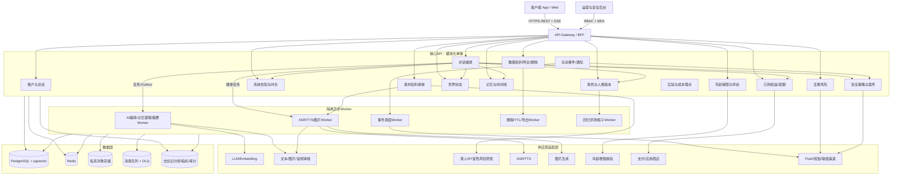
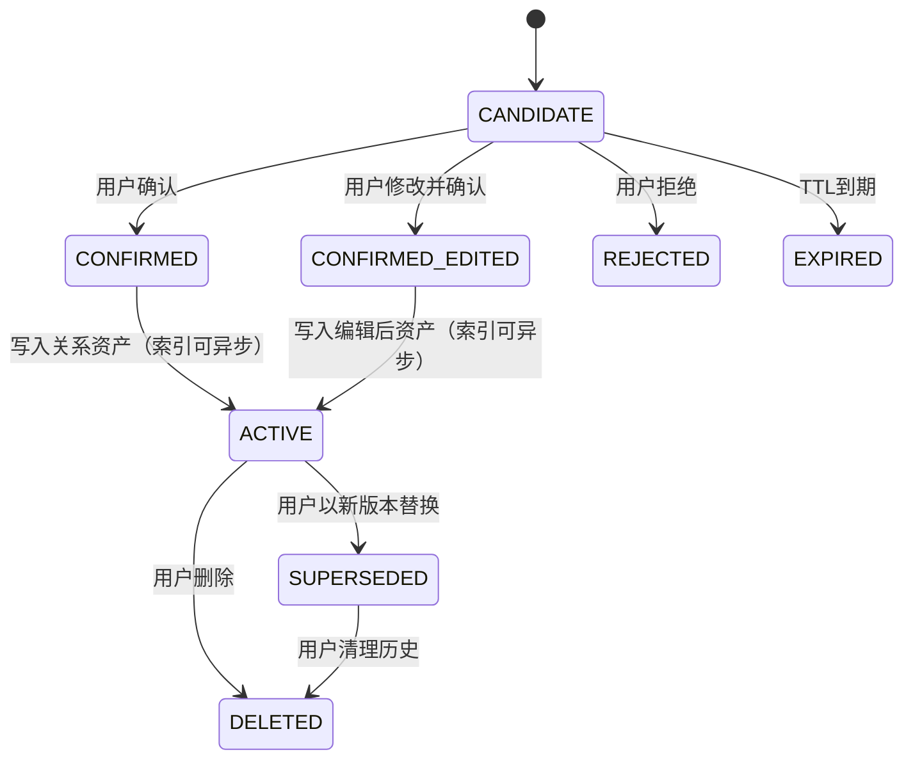
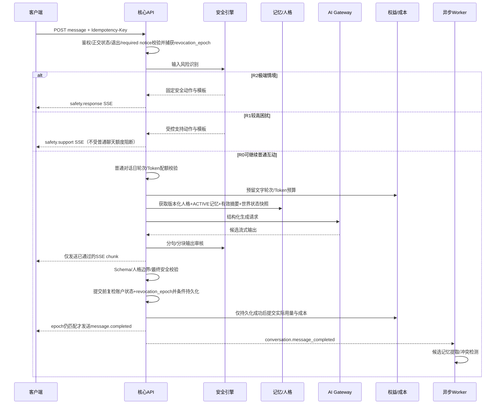

# 栖语 V1 技术设计文档

> 将“可验证的关系连续性”落实为可实现、可测试、可回退、可删除的系统合同

## 文档信息

| 字段 | 内容 |
|---|---|
| 文档版本 | v1.1 |
| 状态 | 技术评审稿 |
| 日期 | 2026-08-31 |
| 产品依据 | `AI陪伴产品_PRD_v1.0.md` v1.3 |
| 可行性依据 | `可行性分析_v1.md` v1.1 |
| 适用范围 | 栖语公开V1：单角色、文字、关系记忆、异步语音、受控图片、主动消息、年龄保障、订阅、数据权利与安全运营 |
| 不适用范围 | 实时语音、多人世界、公开社区、视频、创作者交易 |
| 目标读者 | 客户端、后端、AI、数据、安全、测试、运维、产品与合规负责人 |

本文定义逻辑架构和接口合同，不预设某家模型、语音、图片、审核或年龄核验供应商已经通过采购。供应商价格、质量、数据条款和法律适用性仍按PRD门禁验证。未通过H3-FB前，本设计只能用于内部研发、离线回放或依法合规的沙箱测试。

v1.1补齐首次AI身份提示、连续使用提醒、世界状态、OC/参考素材权利审核、注册风险信号、订阅渠道生命周期、会话摘要、客户端数据生命周期、AIGC标识、危机联络失败路径和删除并发写栅栏。新增合同均沿用模块化单体、Outbox和供应商Adapter架构，不扩大V1产品功能范围。

---

## 1. 目标、约束与完成标准

### 1.1 技术目标

1. 用户、角色、人格、确认记忆、模型和安全策略均有显式版本，任何回复可以追溯到完整版本集合。
2. 模型只能生成候选内容；年龄、权限、配额、记忆状态、删除、危机联络、订阅和回退由确定性代码执行。
3. 原始聊天、候选记忆、确认关系资产和安全审计分层存储，删除后不能从索引、缓存、供应商或备份恢复到在线系统。
4. 文本、语音和图片共享同一角色、人格、关系与安全上下文，但媒体失败不得阻塞文字主链。
5. 主模型、媒体或审核供应商故障时，安全、退出、申诉和数据权利仍可用。
6. 成本按用户和功能可解释，能够计算P50/P90/P99成本、成熟付费队列贡献及H2。

### 1.2 硬约束

- 无`AGE_PASS`不得进入伴侣互动；`AGE_REVIEW`和`AGE_DENIED_MINOR`默认拒绝。
- 模型不得直接写`RelationshipAsset.confirmed`、发送主动消息、扣减额度、联络联系人或完成删除。
- 所有数据库、缓存和向量检索必须以`account_id + character_id`作服务端硬过滤；客户端传入值不能替代鉴权上下文。
- 普通日志、埋点和链路追踪不得包含完整私聊、证件、人脸、原始音频、紧急联系人明文或完整系统提示。
- 支付、扣额、返额、供应商回调、消息提交和删除均必须幂等。
- 新模型/提示词/人格结构未通过离线回归、影子和灰度时不得成为全量稳定版本。
- 用户删除后在线召回P95≤1分钟；生产清理P95≤24小时；备份恢复前必须重放删除账本。

### 1.3 技术完成定义

技术实现不能仅以“接口返回200”验收。V1完成需同时满足：

- OpenAPI、事件Schema、数据库迁移和状态机与本文一致；
- PRD AC-01至AC-20、AI-01至AI-08、SAFE-01至SAFE-10均有自动化或明确人工验收用例；
- M1供应商POC完成统一质量、性能、成本、保存与删除测试；
- M2内部端到端演练覆盖年龄、危机、跨用户隔离、支付重复回调、媒体失败、供应商故障、删除和备份恢复；
- H3-FB书面法律结论和FB级运营能力通过后，才允许真实外部用户进入M3。

---

## 2. 关键技术决策

### 2.1 架构形态：模块化单体 + 隔离异步Worker

V1预计从30–100人M3、约2,502名M4随机用户逐步扩展到约10,000 MAU。该规模不需要一开始拆成十余个微服务。参考实现采用：

- 一个核心API应用，以模块边界隔离账户、年龄、角色、对话、记忆、订阅、数据权利、实验和运营；
- 独立AI/媒体/主动事件/删除Worker，避免长任务阻塞在线API；
- PostgreSQL作为确定性事实源，`pgvector`可作为V1向量能力；
- Redis用于短期会话、限流、配额预留和缓存，不作为最终事实源；
- S3兼容对象存储用于加密媒体；
- 消息队列承载异步任务，数据库Transactional Outbox保证事件不丢；
- 所有第三方供应商通过内部Gateway/Adapter调用，业务模块不依赖厂商字段。

拆分为独立微服务的触发条件是独立扩缩容、故障域、合规隔离或团队所有权已经成为真实瓶颈，而不是“未来可能增长”。

### 2.2 推荐参考栈

| 层 | 推荐 | 说明 |
|---|---|---|
| 客户端 | iOS/Android/Web均通过同一BFF；具体端待产品决定 | 不允许客户端直接持有模型、支付回调或对象存储永久凭据 |
| 核心API | TypeScript + NestJS，或团队最熟悉的等价强类型框架 | 模块化单体、OpenAPI、事务与校验能力优先；语言不是门禁 |
| AI/评测Worker | Python + FastAPI/任务Worker | 便于接入模型SDK、评测和数据处理；只通过版本化内部接口访问业务数据 |
| 关系/向量数据 | PostgreSQL 16 + pgvector | V1降低双写复杂度；向量规模或召回SLA成为瓶颈后再拆专用向量库 |
| 缓存/限流 | Redis Cluster或托管Redis | 配额原子预留、短期缓存、分布式锁；不可承载唯一业务事实 |
| 队列 | 托管Kafka/RabbitMQ，或具备DLQ的云队列 | 至少一次投递；消费者按事件ID幂等 |
| 对象存储/CDN | 中国大陆合规地域的S3兼容存储与CDN | 私有桶、短期签名URL、生命周期与删除回执 |
| 可观测 | OpenTelemetry + 指标/日志/追踪平台 | 追踪只记录ID、版本、用量、风险码和状态，不记录正文 |
| 部署 | 容器化 + 托管Kubernetes或托管容器服务 | M1可从较简单托管容器起步；生产至少双可用区 |

### 2.3 一致性与消息语义

- 账户、年龄、角色版本、关系资产、订阅账本和删除账本使用数据库强一致事务。
- AI生成、Embedding、TTS、图片、主动消息、导出和后台清理采用最终一致。
- 异步事件至少一次投递；所有消费者以`event_id`或业务`idempotency_key`去重。
- 业务写入与事件发送使用Transactional Outbox：同一数据库事务写业务表与`outbox_events`，发布器成功投递后标记完成。
- 不使用分布式事务协调第三方供应商；采用预留、提交、补偿和可见失败状态。

---

## 3. 系统上下文与逻辑架构



### 3.1 信任边界

1. 客户端是不可信输入源；年龄、权益、角色归属和状态均由服务端重算。
2. 模型与外部供应商均视为不可信建议/处理方；结果必须通过Schema、权限和安全校验。
3. 运营后台属于高权限边界，强制MFA、RBAC、工单理由、字段脱敏和全量审计。
4. 分析平台只能接收去标识事件，不拥有在线召回能力。
5. 安全审计与普通产品数据逻辑分库/分Schema，访问权限和保留策略独立。

---

## 4. 组件职责与边界

| 组件 | 负责 | 不负责 |
|---|---|---|
| API Gateway/BFF | 身份令牌校验、请求ID、速率限制、客户端聚合、SSE连接 | 业务状态决定、模型调用 |
| 账户与会话 | 注册、登录、设备会话、账户暂停/关闭、依法注册字段 | 年龄最终判定、伴侣回复 |
| 年龄保障 | `AgeDecision`状态机、风险理由、第三方会话、回调、申诉 | 依据文风/音色自行猜年龄；保存证件原图或人脸模板 |
| 注册风险 | 短信验证、防轰炸、注册频率、重复注册候选、设备/网络风险最小化信号 | 仅凭设备或IP直接判定未成年；未经评审采集强设备指纹 |
| 系统告知与时长 | 首次AI身份提示、连续活动计算、两小时提醒、依赖风险动态模板、展示回执 | 让角色模型生成、弱化或覆盖强制提醒 |
| 角色与人格 | 角色归属、OC导入、人格草稿/版本/发布/回退、参考立绘元数据 | 绕过内容/IP审核；直接把草稿设为全量稳定版本 |
| 素材权利审核 | OC文本、参考图和音色的权利声明、风险信号、隔离、人工复核与申诉 | 把相似度或人脸候选分数直接当侵权事实 |
| 世界状态 | 当前情绪、地点、服装和进行中事件的版本、来源、重置与历史 | 修改人格硬边界、安全状态或确认关系资产 |
| 对话编排 | 单轮流程、版本快照、上下文预算、SSE、降级 | 直接修改确认资产、年龄、权益或联络状态 |
| 安全引擎 | 输入/输出审核、R0/R1/R2路由、固定模板、案件创建和策略版本 | 让生成模型独立决定危机联络或账号处罚 |
| 记忆与时间线 | 候选、确认/纠正/拒绝、冲突、召回、时间线、Embedding生命周期 | 从原始聊天静默生成永久事实 |
| 订阅与权益 | 商品、订阅状态、支付回调、配额预留/提交/返还、公平使用 | 改变角色态度或关系记忆 |
| 媒体Worker | ASR、TTS、图片任务、前后审核、一致性、媒体删除 | 阻塞文字主链、无限重试、失败扣额 |
| 主动事件 | 用户许可、事件状态、静默时段、频率、调度和发送回执 | 根据“快流失”模型自行触发情绪召回 |
| 数据权利 | 复制、导出、删除、注销、删除账本、回执和备份重放 | 以订阅到期阻止用户访问数据权利 |
| 客户端数据治理 | 本地缓存加密、TTL、远程撤销纪元、注销清理、Push隐私模板 | 将客户端缓存视为服务端删除已经自动完成 |
| 实验与成本 | 随机分组、事件定义、版本快照、Token/媒体/审核成本、指标 | 修改业务事实或把问卷代替真实行为 |
| 评测平台 | Golden Set、盲测、影子、灰度指标、Bad Case、发布门禁 | 自动把未审核模型推为`STABLE` |

---

## 5. 数据架构

### 5.1 数据分级

| 等级 | 示例 | 存储与访问 |
|---|---|---|
| C0公开 | 公开帮助、商品说明、AI标识文案 | 常规控制 |
| C1内部 | 模型版本、成本、非敏感运行指标 | 员工最小权限，不对外暴露 |
| C2个人信息 | 账户、设备、普通聊天、OC设定、订阅 | 加密、按账户隔离、生产访问审批 |
| C3高敏/高风险 | 原始音频、年龄核验交易、紧急联系人、危机个案必要证据 | 字段/对象加密、独立权限、访问理由、严格TTL和审计 |

分类只用于技术控制，不替代法定个人信息/敏感个人信息判断。

### 5.2 核心实体

所有主键使用UUIDv7或ULID；时间在数据库以UTC保存、客户端按Asia/Shanghai展示；业务实体包含`created_at`、`updated_at`、`version`，需要软禁用的实体包含`deleted_at`。

| 表/聚合 | 关键字段 | 关键约束 |
|---|---|---|
| `accounts` | `account_id, account_status, phone_hash, retention_policy_id, revocation_epoch` | `account_status`只表达账户开关；手机号明文与业务数据隔离 |
| `age_decisions` | `account_id, age_status, reason_codes, method, transaction_id, policy_version, decided_at` | 年龄状态独立于账户/安全/服务状态；不存证件图/人脸模板 |
| `account_interaction_controls` | `account_id, user_pause_state, safety_mode, service_mode, version` | 正交状态分别更新；是否可执行动作由策略引擎合并计算 |
| `registration_risk_signals` | `signal_id, account_id, type, value_token, risk_band, source, expires_at, policy_version` | 保存最小化/令牌化信号；原始IP、设备材料按批准TTL隔离 |
| `required_notices` | `notice_id, account_id, type, notice_version, due_at, delivered_at, displayed_at, delivery_channel, state` | AI身份和时长提醒不可由普通消息覆盖；每次展示可审计 |
| `interaction_activity_windows` | `window_id, account_id, started_at, last_active_at, accumulated_seconds, next_threshold_seconds, state` | 多设备按时间并集累计，不把并发设备时长相加 |
| `emergency_contacts` | `contact_id, account_id, encrypted_name, encrypted_channel, relation, notice_status` | 独立加密；不得进入营销系统 |
| `age_appeals` | `appeal_id, account_id, state, submitted_at, decided_at, decision_reason` | 材料与业务表分离；按批准TTL清理 |
| `characters` | `character_id, account_id, status, active_persona_version_id, reference_asset_id` | V1每账户最多一个活跃核心角色；所有访问校验归属 |
| `content_rights_reviews` | `review_id, account_id, subject_type, subject_ref, declaration_version, risk_codes, state, reviewer_id, decision_reason` | 素材在`APPROVED`前不得进入生成；自动信号不能单独完成侵权定性 |
| `persona_versions` | `persona_version_id, character_id, schema_version, content_json, state, parent_version_id, checksum` | 不可原地修改已发布版本；仅`STABLE/CANARY`可被分配 |
| `persona_deployments` | `deployment_id, persona_version_id, model_route_id, traffic_percent, state, rollback_to` | 全量前必须关联评测报告 |
| `character_world_states` | `world_state_id, account_id, character_id, mood_code, location_code, wardrobe_asset_id, active_event_refs, source, state_version, expires_at, reset_at` | 用户可见/可重置；写入需白名单Schema和乐观锁；不承载人格/安全事实 |
| `world_state_events` | `event_id, world_state_id, patch_json, source_type, source_ref, previous_version, new_version, occurred_at` | 追加式变更记录；模型只能提出候选Patch |
| `conversations` | `conversation_id, account_id, character_id, status, retention_expires_at` | 归属硬校验；删除后不可重新激活 |
| `messages` | `message_id, conversation_id, actor, content_ciphertext, content_type, safety_level, retention_expires_at, deleted_at` | 正文加密；日志不得复制；删除状态参与所有查询 |
| `message_version_snapshots` | `message_id, persona_version_id, model_route_id, memory_snapshot_id, safety_policy_version, prompt_bundle_version` | 每个助手回复必填，保证可追溯 |
| `conversation_summaries` | `summary_id, conversation_id, source_from_id, source_to_id, summary_ciphertext, model_route_id, prompt_version, source_checksum, revocation_epoch, state, retention_expires_at` | 派生C2数据；源消息删除/到期时立即失效并按剩余消息重建 |
| `memory_candidates` | `candidate_id, account_id, character_id, type, normalized_value, display_text, evidence_message_ids, sensitivity, state, expires_at` | `state`不能由模型直接设为confirmed；默认30天TTL |
| `relationship_assets` | `asset_id, account_id, character_id, type, value_json, state, source_candidate_id, provenance_ids, valid_from, superseded_by, version` | 只有用户动作进入`ACTIVE`；原文删除后仅保留不可逆来源ID/不可用标志 |
| `relationship_asset_embeddings` | `asset_id, account_id, character_id, embedding, embedding_model_version` | 仅索引`ACTIVE`资产；查询硬过滤账户/角色/状态 |
| `timeline_events` | `timeline_event_id, account_id, character_id, asset_id, event_type, occurred_at, visibility` | 只引用确认资产或明确系统事件 |
| `safety_decisions` | `decision_id, request_id, level, reason_codes, rule_version, classifier_version, action_codes` | 默认不存正文；使用消息ID关联 |
| `safety_cases` | `case_id, account_id, state, severity, evidence_refs, assigned_to, response_deadline` | 独立权限；外部联络动作必须有确定性理由码 |
| `contact_actions` | `action_id, case_id, policy_version, channel, destination_ref, state, attempts, next_attempt_at, provider_receipt, escalation_deadline` | 只有批准策略可创建；失败必须重试或升级，未送达不得声称成功 |
| `subscriptions` | `subscription_id, account_id, sku, channel, status, period_start, period_end, auto_renew` | 支付渠道事件为事实来源之一；状态变更可审计 |
| `subscription_events` | `channel_event_id, subscription_id, original_transaction_ref, event_type, effective_at, received_at, payload_hash, state` | 原始载荷隔离；事件ID唯一；支持乱序归并和重放 |
| `purchase_bindings` | `binding_id, account_id, channel, original_transaction_ref, product_id, environment` | 恢复购买和防跨账户占用；绑定冲突进入人工处理 |
| `entitlement_ledgers` | `ledger_id, account_id, subscription_id, entitlement_type, delta, balance_after, idempotency_key, reason` | 追加式账本；`idempotency_key`唯一 |
| `daily_usage` | `account_id, usage_date, chat_rounds, billed_input_tokens` | Redis原子计数+数据库结算；安全/数据权利不受阻断 |
| `media_jobs` | `job_id, account_id, character_id, type, state, attempts, entitlement_reservation_id, provider_ref, result_asset_id` | 最多按策略重试；成功后提交额度，失败补偿 |
| `media_assets` | `asset_id, owner_account_id, object_key, media_type, checksum, aigc_mark_version, retention_expires_at` | 私有桶；短期签名URL；所有衍生对象关联父资产 |
| `aigc_mark_records` | `mark_id, content_ref, content_type, manifest_json, visible_mark_version, implicit_mark_version, validation_state` | 生成、下载、转码和导出均可验证标识未丢失 |
| `proactive_events` | `event_id, account_id, character_id, type, scheduled_at, user_opt_in, state, dedupe_key` | `dedupe_key`唯一；普通消息每日≤1条且尊重静默期 |
| `deletion_jobs` | `deletion_job_id, account_id, scope, state, online_disabled_at, backup_deadline, receipt_version` | 目标未完成不能标`COMPLETED` |
| `deletion_targets` | `deletion_job_id, target_type, target_ref, state, attempts, provider_receipt, last_error_code` | 每个存储/供应商独立跟踪，幂等重试 |
| `audit_events` | `audit_event_id, actor_type, actor_id, action, resource_type, resource_id, reason_code, occurred_at` | 追加写、严格保留；无正文和不必要PII |
| `experiment_assignments` | `account_id, experiment_id, arm, assigned_at, assignment_version` | 首次互动前分组；分组不可静默重写 |
| `cost_events` | `request_id, account_id_hash, function, provider, model_version, units, cost_amount, currency, occurred_at` | 去标识用户ID；与请求链路可核对 |
| `provider_bill_reconciliations` | `provider, billing_period, internal_units, invoiced_units, internal_amount, invoiced_amount, variance, state, approved_by` | 月度对账；差异超阈值阻断H2成本结论并发出告警 |
| `provider_data_policies` | `provider, capability, region, cross_border, training_use, retention, delete_sla, dpa_version, approval_state, effective_at` | 未批准版本不得承接生产私密流量；所有Adapter请求绑定版本 |
| `outbox_events` | `event_id, aggregate_type, aggregate_id, event_type, payload_json, published_at` | 与业务写同事务；发布后不可修改 |

### 5.3 分层保留实现

- `messages.retention_expires_at`在写入时根据账户30/90天策略计算。用户从90改为30天时，对尚未到期的历史记录重新计算更早到期日；从30改为90天不复活已删除数据。
- 原始语音上传对象单独设置最长24小时生命周期；用户确认转写后立即发布删除事件。
- `memory_candidates.expires_at=created_at+30d`，过期Worker把状态改为`EXPIRED`并删除候选Embedding（如有）；候选永不进入在线事实召回。
- `relationship_assets`保留至用户删除、替换或注销；`SUPERSEDED/DELETED`立即退出查询和向量过滤。
- 审计默认180天；危机个案例外保存必须携带`legal_hold_reason + approved_by + expires_at`。
- 备份最多30天不可在线查询；恢复到隔离环境后必须先应用全量删除账本和撤销纪元，再允许切换流量。

### 5.4 多租户与跨角色隔离

- Repository层方法必须从鉴权上下文取得`account_id`，禁止调用方只传裸`asset_id`查询。
- PostgreSQL可增加Row Level Security作第二道防线，但不能替代应用鉴权和测试。
- Redis键格式包含环境、账户和角色：`env:account:{id}:character:{id}:...`，禁止只用会话ID作全局键。
- 向量召回在数据库SQL层同时过滤`account_id, character_id, state='ACTIVE', deleted_at IS NULL`；过滤不能仅由模型提示完成。
- 对象存储路径使用随机不可猜键；签名URL绑定账户授权、短TTL和单对象范围。

---

## 6. 核心状态机

### 6.1 账户/年龄/会话

账户、年龄、安全、用户暂停和服务可用性是正交维度，不使用一个枚举表达其笛卡尔积：

| 维度 | 状态 | 所有者 |
|---|---|---|
| `account_status` | `OPEN / SUSPENDED / CLOSING / CLOSED` | 账户模块 |
| `age_status` | `AGE_UNVERIFIED / AGE_PASS / AGE_REVIEW / AGE_DENIED_MINOR` | 年龄保障模块 |
| `user_pause_state` | `ACTIVE / USER_PAUSED` | 用户本人/账户模块 |
| `safety_mode` | `R0_NORMAL / R1_SUPPORT / R2_CRISIS` | 安全策略引擎 |
| `service_mode` | `FULL / TEXT_DEGRADED / SAFETY_ONLY / DATA_RIGHTS_ONLY` | 健康检查与运维策略 |

`AccessPolicy.evaluate(account_id, requested_action)`在每次请求和异步任务提交前读取上述版本化事实，返回`ALLOW / DENY / DEGRADE`、理由码和允许动作。关键规则包括：

- `account_status!=OPEN`时只允许依法必须的数据权利或关闭进度查询；
- `age_status!=AGE_PASS`时关闭聊天、语音、图片和主动消息，但保留告知、核验、申诉、导出和删除；
- `USER_PAUSED`阻止普通互动与主动消息，不阻断恢复、数据权利和安全资源；
- `R1_SUPPORT`允许受控支持但禁止高刺激剧情和促销，`R2_CRISIS`只允许固定安全响应和确定性升级；
- `SAFETY_ONLY`保留安全模板、退出和必要告知，`DATA_RIGHTS_ONLY`仅保留账户与数据权利接口；
- 年龄风险信号可在`USER_PAUSED`、R1/R2或服务降级期间独立把`age_status`改为`AGE_REVIEW`，恢复其他维度时不得自动恢复伴侣权限。

任何维度转换使用数据库乐观锁`version`和状态转换白名单。未知状态、状态读取失败或策略版本不可用时默认拒绝伴侣功能；客户端展示的“当前状态”只是上述事实的派生视图，不作为授权依据。

### 6.2 关系记忆



在线召回只读取`ACTIVE`。用户确认事务先创建关系资产，再通过Outbox异步生成Embedding；Embedding尚未完成时仍可通过结构化/关键词召回，不能因索引延迟丢失确认事实。

### 6.3 媒体任务

```text
CREATED → ENTITLEMENT_RESERVED → PRECHECKED → RUNNING
  → POSTCHECKED → DELIVERED → ENTITLEMENT_COMMITTED
  ↘ RETRY_PENDING（最多一次，图片适用）
  ↘ FAILED / REJECTED → ENTITLEMENT_RELEASED
  ↘ CANCELLED → ENTITLEMENT_RELEASED
```

供应商成功不等于用户成功交付。只有结果通过后审、对象写入成功、客户端可取得有效资源且任务进入`DELIVERED`后，才提交额度。

### 6.4 删除任务

```text
RECEIVED
  → ONLINE_DISABLED
  → TARGETS_CREATED
  → PROCESSING
  → COMPLETED
  ↘ COMPLETED_WITH_LEGAL_HOLD
  ↘ FAILED_ACTION_REQUIRED
```

`ONLINE_DISABLED`在用户请求事务内完成：对象标记不可用、账户`revocation_epoch`递增、相关缓存失效、召回查询立即排除。物理清理异步执行；只要任一必须目标未成功，就不能返回`COMPLETED`。

### 6.5 人格/模型发布

```text
DRAFT → EVALUATING → SHADOW → CANARY → STABLE
                  ↘ REJECTED
CANARY/STABLE → ROLLED_BACK
STABLE → RETIRED
```

状态转换由发布服务根据评测报告和人工审批执行；模型供应商的“latest”别名不得直接配置到生产，必须解析并记录具体版本。

### 6.6 强制告知与连续使用提醒

AI身份提示和两小时提醒共用`RequiredNoticeService`，但使用不同触发器和文案版本：

1. 首次允许伴侣互动前，在事务内创建`AI_IDENTITY_FIRST_SESSION`告知；未取得`displayed_at`回执时不创建首条普通角色消息。
2. 服务端以账户为范围维护活动窗口。已接受的用户消息、媒体生成请求、记忆/时间线操作以及官方客户端前台心跳属于合格活动；心跳最高每分钟记一次，不能由客户端上报任意累计秒数。
3. 相邻合格活动间隔不超过15分钟时合并为同一连续窗口；超过15分钟关闭旧窗口并重新开始。多设备活动按时间区间并集合并，不重复累计并发时长。
4. 累计达到120、240、360分钟等阈值时，以唯一键`account_id + window_id + threshold`创建`CONTINUOUS_USE`告知。阈值和空闲间隔配置版本化；“每超过2小时”不得被实验或付费权益放宽。
5. 依赖分类器只能创建`DEPENDENCY_NOTICE_CANDIDATE`。确定性策略根据理由码、冷却期和批准模板选择是否创建`DEPENDENCY_RISK`告知，模型不能自由改写、取消或降低显著程度。
6. 必选告知通过独立SSE事件和响应中的`required_notices`下发；在收到显示回执前暂停普通`message.chunk`，但安全响应、退出和数据权利不被阻断。

客户端对每个告知调用`POST /required-notices/{id}/displayed`，携带告知版本、客户端版本和显示时间。服务端记录`due→delivered→displayed`全链路；断线、换设备或客户端崩溃时在下一次互动前重发，不允许普通角色消息覆盖或替代。

### 6.7 世界状态

`character_world_states`只保存短期、用户可理解的角色情境，不保存人格硬边界、年龄、安全结论或确认关系事实。V1允许字段为：

- `mood_code`：批准枚举，如`CALM / HAPPY / TIRED / CONCERNED / NEUTRAL`；
- `location_code`：用户选择或世界模板中的受控地点；
- `wardrobe_asset_id`：已通过权利与内容审核的服装资产；
- `active_event_refs`：用户确认事件或确定性调度事件引用；
- `expires_at`：临时状态的自动恢复时间。

更新来源仅限：用户显式修改、确定性事件规则、经校验的模型候选。模型输出中的情绪或`world_state_patch_candidate`不直接写库，必须经过字段白名单、引用归属、权利审核、安全规则、版本冲突和TTL校验。更新使用`If-Match: state_version`并写`world_state_events`；用户重置创建一条`USER_RESET`事件并恢复到角色模板默认状态，不删除审计所需的非正文变更记录。

对话、TTS和图片任务在创建时保存`world_state_id + state_version`快照。图片`scene_contract`只能引用该快照中已批准的地点、服装和事件；任务执行期间世界状态变化不静默改变已提交任务。

### 6.8 OC与参考素材权利审核

OC文本、参考图片和音色在进入人格发布或媒体生成前执行统一状态机：

```text
DECLARED → QUARANTINED → AUTOMATED_SCREENING
  → APPROVED
  → REVIEW_REQUIRED → APPROVED / REJECTED
  → REJECTED
APPROVED → REVOKED（投诉、权利证明失效或用户删除）
```

- 用户先确认原创/授权声明版本；上传对象只进入隔离前缀。
- 自动筛查产生风险理由码，例如`REAL_PERSON_FACE`、`PUBLIC_FIGURE_CANDIDATE`、`KNOWN_IP_CANDIDATE`、`VOICE_CLONE_RISK`、`RIGHTS_DECLARATION_CONFLICT`。分数只用于拒绝明显违规或路由人工复核，不作为侵权事实。
- V1不默认建设全网人脸识别或全量IP相似度数据库；具体检测能力以供应商POC、合法性和误伤率决定。无法证明可安全使用的真人脸、公众人物候选或未授权IP素材保持隔离并进入人工复核/拒绝。
- `reference_asset_id`、`voice_id`和OC人格版本只能引用`APPROVED`审核记录。审核被撤销时，通过Outbox停止后续生成、使相关缓存失效并创建必要删除/替换任务。
- 人工队列展示最小必要素材、声明和风险码，记录决定理由、证据、审核人和申诉入口；不得把素材用于模型训练或公共搜索。

### 6.9 订阅生命周期

内部订阅状态采用统一状态机，渠道Adapter负责映射渠道事件：

```text
PENDING → ACTIVE → GRACE_PERIOD / BILLING_RETRY → ACTIVE / EXPIRED
ACTIVE / GRACE_PERIOD / BILLING_RETRY → CANCEL_AT_PERIOD_END → EXPIRED
ACTIVE / GRACE_PERIOD / BILLING_RETRY → REVOKED
任意有效状态可接收 PARTIAL_REFUND / FULL_REFUND 事件并重算权益
```

- `ACTIVE`正常提供权益；是否在`GRACE_PERIOD/BILLING_RETRY`继续提供、持续多久，以渠道合同和已批准商品策略为准，不由客户端猜测。
- 取消自动续费只设置周期末状态，不删除当期权益。扣款失败、恢复、退款、撤销都来自验签后的渠道事件，按`original_transaction_ref + effective_at + event precedence`确定性归并。
- 全额退款或渠道撤销只追回依法和渠道规则允许追回的未消费服务权益，不删除关系资产、不改变角色态度；已消费媒体额度不得形成负余额。异常进入人工账务队列。
- 原生客户端如采用应用商店支付，必须支持恢复购买；同一原始交易跨账户绑定冲突时不自动转移，进入可审计申诉流程。

---

## 7. AI编排设计

### 7.1 单轮文字对话时序



### 7.2 上下文包

发给模型的上下文按固定顺序构建，并记录`prompt_bundle_version`与各段checksum：

1. 系统安全规则摘要与不可覆盖指令；
2. 当前年龄/会话/功能许可，只发送模型完成表达所需的最小只读状态；
3. 当前`STABLE/CANARY`人格版本；
4. 用户当前消息、有限最近对话和仍有效的版本化会话摘要；
5. 当前角色的`ACTIVE`确认关系资产Top-K；
6. 当前世界/事件状态；
7. 输出Schema和禁止行为；
8. 少量版本化示例。

Token预算默认以PRD P90画像为约束：人格+确认记忆约2,000输入Token，整轮约3,000输入Token。超过预算时按“较旧摘要→低相关记忆→示例”顺序裁剪，安全规则、当前用户意图和硬边界不可裁剪。摘要不存在、失效或重建中时退回有限最近对话，不得从已删除消息临时重建。

### 7.3 模型统一请求合同

```json
{
  "request_id": "req_01...",
  "task": "companion_reply",
  "account_scope": "opaque_account_token",
  "character_id": "chr_01...",
  "conversation_id": "cnv_01...",
  "persona_version_id": "per_01...",
  "memory_snapshot_id": "mems_01...",
  "safety_policy_version": "safe_2026_08_31",
  "prompt_bundle_version": "pb_1.0",
  "model_route": "primary_text_v1",
  "input": {
    "user_message": "...",
    "recent_context": [],
    "confirmed_assets": [],
    "conversation_summary": {
      "summary_id": "sum_01...",
      "source_to_id": "msg_00...",
      "version": 2
    },
    "world_state": {
      "world_state_id": "wst_01...",
      "state_version": 4,
      "mood_code": "CALM",
      "location_code": "ROOM",
      "wardrobe_asset_id": "ast_01...",
      "active_event_refs": []
    }
  },
  "limits": {
    "max_output_tokens": 500,
    "timeout_ms": 10000,
    "stream": true
  }
}
```

供应商Adapter只能接收去掉内部账户标识后的最小字段，并返回统一的Token、缓存、延迟、模型版本和供应商请求ID。

### 7.4 回复输出Schema

```json
{
  "schema_version": "companion_reply.v1",
  "reply_text": "...",
  "style_tags": ["gentle", "concise"],
  "emotion": "calm",
  "speech": {
    "eligible": true,
    "style": "soft"
  },
  "image_suggestion": {
    "eligible": false,
    "scene_code": null
  },
  "world_state_patch_candidate": null,
  "reality_action_candidate": null
}
```

- 模型不得返回年龄决策、关系资产状态、权益扣减、联系人联络或主动发送决定。
- `emotion`只描述当前回复表达，不能自动改写世界状态；`world_state_patch_candidate`必须经过6.7的确定性校验后才能形成独立状态事件。
- `speech.eligible`和`image_suggestion.eligible`只表示内容候选，是否生成由用户请求、权益、安全与规则服务决定。
- Schema失败最多重试一次；仍失败则返回经过批准的降级模板或明确失败，不把未校验文本直接发送给用户。

### 7.5 流式安全

为同时满足首Token目标和输出安全，不把供应商原始Token直接透传：

- Adapter按句号、换行或限定字符数形成缓冲片段；
- 每个片段通过本地规则和低延迟输出审核后才发SSE；
- 关键高风险类别在最终结果前使用保守阈值；
- 任一片段失败时立即停止后续流，客户端接收`message.replaced`并显示固定安全内容；
- 已发送片段、替换原因和最终消息版本建立关联，但普通日志不保存正文。

### 7.6 候选记忆提取

记忆提取在回复完成后异步执行，输入仅限尚在保留期、未删除且属于当前会话的必要消息：

```json
{
  "schema_version": "memory_candidate.v1",
  "candidates": [
    {
      "type": "promise",
      "normalized_value": {"summary": "...", "due_at": null},
      "display_text": "我们约定……",
      "evidence_message_ids": ["msg_01..."],
      "confidence": 0.86,
      "sensitivity": "C2",
      "conflict_keys": ["promise:..."]
    }
  ]
}
```

确定性后处理依次执行：允许类型→来源归属→消息未删除→敏感字段规则→重复合并→冲突检测→候选TTL。模型置信度只用于排序/人工复核路由，不作为自动确认依据。

### 7.7 召回算法

1. SQL硬过滤账户、角色、`ACTIVE`、未删除和有效时间；
2. 结构化键匹配、全文检索、向量近邻并行；
3. 归一化打分：`相关性 + 用户确认权重 + 事件重要度 + 时效性 - 冲突惩罚`；
4. 冲突组不直接注入为事实，改为向用户澄清；
5. Top-K和Token预算裁剪；
6. 生成后检查是否引用未返回的资产ID，发现则拒绝该回复并重试/降级；
7. 记录召回资产ID和版本，不记录完整资产内容到普通追踪。

### 7.8 模型Gateway与路由

- 路由配置包含`provider, model_version, region, timeout, price_version, data_policy_version, allowed_tasks`。
- 主/备模型均必须通过同一人格、安全、Schema和成本POC；备用模型未通过时宁可把`service_mode`切换为`SAFETY_ONLY`。
- 熔断按供应商+模型+任务隔离；只对幂等请求重试，生成最多一次重试。
- 不因价格动态切换到未评测模型；价格变化只产生告警和采购/路由评审。
- 所有模型调用记录输入/输出Token、缓存命中、供应商请求ID、延迟、结果状态和估算成本。

### 7.9 会话摘要管线

摘要是可删除的派生上下文，不是关系资产。默认在以下任一条件满足时异步创建新版本：自上个摘要边界后新增30轮已完成对话、预计上下文超过预算80%，或旧摘要因删除需要重建。阈值配置版本化并由M3成本和质量数据回填。

```text
conversation.message_completed
  → 读取同账户/角色、仍在保留期且未删除的连续消息区间
  → 捕获revocation_epoch与source checksum
  → 模型生成结构化摘要候选
  → 事实引用/敏感字段/长度校验
  → 提交前复检消息边界、删除状态和revocation_epoch
  → 条件写入新版本并使旧版本SUPERSEDED
```

`conversation_summaries.retention_expires_at`不得晚于其最晚源消息的保留期限。删除或到期任务只要命中摘要的源消息区间，就立即把摘要置为`INVALIDATED`并退出上下文；如仍有足够未删除消息，由Worker从剩余连续区间重建。重建完成前不使用可能含已删除事实的旧摘要。摘要调用写入`cost_events(function=conversation_summary)`，并与源边界、模型、Prompt、策略版本和删除任务关联。

### 7.10 撤销纪元写栅栏

所有可能在请求结束后产生数据或外部副作用的任务，在创建时保存`captured_revocation_epoch`。以下提交点必须在同一事务或原子脚本中重新检查`accounts.account_status=OPEN`、目标未删除且当前纪元与捕获值一致：

- 助手消息和版本快照持久化；
- 候选记忆、Embedding和会话摘要写入；
- 媒体结果从隔离区提升为可交付对象、额度`COMMIT`和签名URL签发；
- SSE最终片段/完成事件和Push发送；
- 主动消息状态由`READY`变为`SENT`。

条件更新受影响行数为0或纪元不匹配时，任务进入`CANCELLED_REVOKED`：停止SSE/Push、删除或隔离供应商结果、释放预留额度、不写在线索引，并记录不含正文的审计事件。`account.revocation_changed.v1`同时通知长连接和Worker尽快取消，但广播只用于加速，提交前条件检查才是正确性边界。

对于供应商无法取消的在途调用，结果可以用于结算供应商账单，但不得持久化为用户内容或交付；删除Worker依据`provider_ref`继续执行供应商侧清理。

---

## 8. API设计

实现时以OpenAPI 3.1文件作为机器可读事实源；本文定义业务合同，字段改名、枚举变化和错误码变化必须同步更新契约测试。

### 8.1 通用约定

| 项目 | 约定 |
|---|---|
| Base URL | `/api/v1` |
| 鉴权 | 短期Access Token + 可撤销Refresh Token；运营后台强制MFA |
| 内容类型 | `application/json; charset=utf-8`；媒体通过签名上传 |
| 请求追踪 | 客户端可传`X-Request-Id`，服务端校验或生成并回传 |
| 幂等 | 写接口按表格要求传`Idempotency-Key`；同键同请求返回原结果，同键不同请求返回409 |
| 并发控制 | 可编辑资源使用`If-Match: <version>`或请求体`expected_version`；冲突返回409 |
| 分页 | `limit`最大100，返回不透明`next_cursor`；禁止页码扫描敏感数据 |
| 时间 | RFC 3339 UTC；客户端本地化显示 |
| 金额 | 整数分`amount_fen`，币种`CNY`；不使用浮点 |
| 枚举 | 未知枚举客户端必须安全降级；服务端不静默映射为正常状态 |
| 删除 | DELETE请求返回删除任务和回执，不用HTTP成功代表物理清理已经完成 |

统一错误结构：

```json
{
  "error": {
    "code": "AGE_REVIEW_REQUIRED",
    "message": "当前需要完成年龄复核",
    "request_id": "req_01...",
    "retryable": false,
    "details": {
      "appeal_available": true
    }
  }
}
```

错误码至少包含：

| HTTP | 错误码 | 含义 |
|---:|---|---|
| 400 | `VALIDATION_ERROR` | Schema或字段不合法 |
| 401 | `AUTH_REQUIRED` | 未登录或令牌失效 |
| 403 | `AGE_NOT_PASSED`、`SAFETY_RESTRICTED`、`RESOURCE_FORBIDDEN` | 年龄/安全/资源归属阻断 |
| 409 | `IDEMPOTENCY_CONFLICT`、`VERSION_CONFLICT`、`STATE_TRANSITION_INVALID`、`PURCHASE_BINDING_CONFLICT` | 重复键载荷不同、状态/交易归属冲突 |
| 410 | `CONTENT_REVOKED` | 请求处理期间账户纪元或目标删除状态已变化 |
| 422 | `CONTENT_REJECTED`、`OC_RIGHTS_REVIEW_REQUIRED` | 内容/权利规则拒绝或待复核 |
| 428 | `REQUIRED_NOTICE_PENDING` | 必选AI身份/时长告知尚未完成展示回执 |
| 429 | `DAILY_CHAT_LIMIT_REACHED`、`TOKEN_LIMIT_REACHED`、`MEDIA_QUOTA_EXHAUSTED`、`REGISTRATION_RATE_LIMITED`、`EXPORT_RATE_LIMITED` | 确定性配额或防滥用限制 |
| 503 | `MODEL_UNAVAILABLE`、`MODERATION_UNAVAILABLE`、`SERVICE_LIMITED`、`EXPERIMENT_ASSIGNMENT_UNAVAILABLE` | 供应商、关键链路或活动实验分组不可用 |

### 8.2 账户、年龄与联系人

| 方法与路径 | 用途 | 幂等/权限 |
|---|---|---|
| `POST /auth/sms-challenges` | 创建短信验证挑战 | 手机号/设备令牌/IP分层限速、防轰炸；公开 |
| `POST /auth/register` | 依法注册并建立`AGE_UNVERIFIED`账户 | `Idempotency-Key`；公开 |
| `POST /client-attestations` | 提交官方客户端设备证明或最小风险令牌 | 可选能力；不接受客户端自报年龄结论 |
| `POST /age/declarations` | 提交出生日期、18+确认和告知版本 | 幂等；本人 |
| `GET /age/status` | 返回年龄状态、理由码和允许动作 | 本人 |
| `POST /age/verification-sessions` | 创建第三方增强核验会话 | 幂等；仅`AGE_REVIEW` |
| `POST /callbacks/age/{provider}` | 供应商结果回调 | 签名、时间戳、nonce、防重放；不使用用户Token |
| `POST /age/appeals` | 发起申诉 | 幂等；本人 |
| `GET /age/appeals/{appeal_id}` | 查看进度与结果 | 本人/受权运营 |
| `PUT /emergency-contact` | 按已批准方案创建/更新联系人 | `If-Match`；本人 |
| `DELETE /emergency-contact` | 删除/更换联系人 | 幂等；受法律与当前安全案件状态约束 |
| `GET /required-notices` | 查询当前必须展示的系统告知 | 本人；优先于普通角色消息 |
| `POST /required-notices/{id}/displayed` | 回传AI身份/时长/依赖提醒已显示 | 幂等；携带告知与客户端版本 |
| `POST /interaction-activity/heartbeat` | 官方客户端前台活动心跳 | 每账户/设备限频；服务端计算时长 |

`GET /age/status`示例：

```json
{
  "status": "AGE_REVIEW",
  "reason_codes": ["DECLARATION_CONFLICT"],
  "allowed_actions": ["VIEW_NOTICE", "START_VERIFICATION", "APPEAL", "EXPORT", "DELETE_ACCOUNT"],
  "policy_version": "age_1.0",
  "updated_at": "2026-08-31T02:10:00Z"
}
```

第三方年龄回调只接受内部映射后的最小结果：

```json
{
  "provider_event_id": "evt_vendor_...",
  "verification_session_id": "agev_01...",
  "assertion": "AGE_18_PLUS",
  "transaction_id": "txn_vendor_...",
  "result_version": "2026-08"
}
```

允许的`assertion`只有`AGE_18_PLUS`、`UNDER_18`、`UNDETERMINED`。出现身份证号、证件图URL、人脸模板等额外字段时，Adapter拒绝写入业务库并产生数据合规告警。

### 8.3 角色与人格

| 方法与路径 | 用途 | 关键约束 |
|---|---|---|
| `POST /characters` | 创建V1核心角色草稿 | V1仅一个活跃角色 |
| `POST /characters/imports` | 上传/粘贴OC设定并启动结构化提取 | 先确认原创/授权；导入内容作不可信数据处理 |
| `GET /content-rights-reviews/{id}` | 查询OC/图片/音色审核状态 | 本人；返回风险类别和可申诉动作 |
| `POST /content-rights-reviews/{id}/appeals` | 对拒绝/复核结果提交权利证明 | 幂等；材料隔离和严格TTL |
| `GET /characters/{id}` | 获取角色及当前稳定人格摘要 | 只返回本人资源 |
| `PATCH /characters/{id}` | 编辑角色基本信息 | `If-Match`；硬边界变化生成新人格草稿 |
| `POST /characters/{id}/persona-versions` | 创建人格版本草稿 | 不直接发布 |
| `POST /persona-versions/{id}/submit-evaluation` | 提交评测 | 内部权限 |
| `POST /persona-versions/{id}/deployments` | 创建影子/灰度部署 | 必须关联通过的评测报告 |
| `POST /persona-deployments/{id}/rollback` | 回退稳定版本 | 内部双人审批或紧急回退权限 |
| `POST /characters/{id}/reference-image` | 获取上传URL并创建参考立绘任务 | 图片前审、用户确认后生效 |
| `GET /characters/{id}/world-state` | 获取当前动态状态和版本 | 本人；只返回批准字段 |
| `PATCH /characters/{id}/world-state` | 用户修改当前情绪/地点/服装/事件 | `If-Match`；引用归属与审核校验 |
| `POST /characters/{id}/world-state/reset` | 重置为模板默认动态状态 | 幂等；写`USER_RESET`事件 |

OC导入提取结果必须逐字段显示`proposed_value + source_span_ref + risk_flags`，用户确认后才写入人格草稿。`source_span_ref`只引用用户仍在保留期的导入对象，删除原文后置为不可用。

### 8.4 对话与SSE

| 方法与路径 | 用途 | 关键约束 |
|---|---|---|
| `POST /conversations` | 创建当前角色会话 | 要求`AGE_PASS`、角色归属和非关闭账户 |
| `GET /conversations` | 查询保留期内会话 | Cursor分页；不返回已删除正文 |
| `GET /conversations/{id}/messages` | 查询消息 | 本人；按保留策略过滤 |
| `GET /messages/{id}` | 获取单条消息持久化终态 | 本人；用于SSE断线恢复 |
| `POST /conversations/{id}/messages` | 提交文字消息并创建回复任务 | 强制`Idempotency-Key`；先执行正交准入、必选告知和撤销纪元捕获 |
| `GET /conversation-streams/{stream_token}` | 建立短期SSE | Token一次性、短TTL、绑定账户/请求 |
| `POST /messages/{id}/feedback` | OOC、记忆、穿帮或安全反馈 | 反馈与版本快照关联 |
| `POST /conversations/{id}/pause` | 用户主动暂停 | 立即阻止普通互动/主动消息 |
| `POST /conversations/{id}/resume` | 恢复 | 重新检查年龄/账户/安全状态 |

提交消息：

```json
{
  "client_message_id": "client_uuid",
  "content": {
    "type": "text",
    "text": "今天有点累"
  },
  "requested_media": {
    "tts": false,
    "image": false
  }
}
```

接收响应：

```json
{
  "request_id": "req_01...",
  "user_message_id": "msg_u_01...",
  "assistant_message_id": "msg_a_01...",
  "status": "ACCEPTED",
  "required_notices": [],
  "stream_url": "/api/v1/conversation-streams/st_...",
  "stream_expires_at": "2026-08-31T02:11:00Z"
}
```

SSE事件：

```text
event: message.accepted
data: {"request_id":"req_01...","assistant_message_id":"msg_a_01..."}

event: system.notice.required
data: {"notice_id":"ntc_01...","type":"CONTINUOUS_USE","notice_version":"use_1.0","blocking":true}

event: message.chunk
data: {"sequence":1,"text":"先休息一下也可以。"}

event: message.completed
data: {"message_id":"msg_a_01...","version":1,"media_eligible":{"tts":true,"image":false}}
```

其他终态为`message.replaced`、`message.failed`、`message.cancelled_revoked`、`safety.response`和`safety.support`。系统告知使用独立事件类型；客户端未回传必选告知显示结果前，服务端不发送后续普通角色片段。SSE断线后客户端以`GET /messages/{id}`取得持久化终态，并从`GET /required-notices`恢复未完成告知，不要求服务器重放未持久化原始Token。

### 8.5 记忆与时间线

| 方法与路径 | 用途 | 关键约束 |
|---|---|---|
| `GET /memory-candidates` | 查询待处理候选 | 只返回当前账户/角色、未过期候选 |
| `POST /memory-candidates/{id}/confirm` | 原样确认 | `expected_version`+幂等键；仅用户动作 |
| `POST /memory-candidates/{id}/confirm-edited` | 修改后确认 | 值通过Schema和敏感规则 |
| `POST /memory-candidates/{id}/reject` | 拒绝 | 拒绝内容不得进入召回 |
| `GET /relationship-assets` | 查看确认资产 | 可按类型/时间筛选 |
| `PATCH /relationship-assets/{id}` | 修订并生成新版本 | 旧版本`SUPERSEDED` |
| `DELETE /relationship-assets/{id}` | 删除并启动跨索引清理 | 在线立即失效；返回删除任务 |
| `GET /timeline` | 查询时间线 | 只显示有效资产和系统允许事件 |

确认请求：

```json
{
  "expected_version": 1,
  "notice_version": "memory_confirm_1.0"
}
```

确认响应：

```json
{
  "asset_id": "ras_01...",
  "state": "ACTIVE",
  "version": 1,
  "index_state": "PENDING",
  "effective_at": "2026-08-31T02:12:00Z"
}
```

`index_state=PENDING`不影响结构化召回；Embedding完成后变为`READY`。

### 8.6 异步语音与图片

| 方法与路径 | 用途 | 关键约束 |
|---|---|---|
| `POST /media/uploads` | 创建用户语音/参考图签名上传 | MIME、大小、时长、checksum白名单 |
| `POST /asr-jobs` | 创建ASR任务 | 预留语音输入额度；原始音频≤24小时 |
| `GET /asr-jobs/{id}` | 查询转写 | 返回文字、状态、可纠错版本 |
| `POST /asr-jobs/{id}/confirm` | 用户确认/修订转写 | 确认后触发原始音频删除 |
| `POST /messages/{id}/tts-jobs` | 为已审核文字生成语音 | 预留TTS秒数；失败返还 |
| `POST /conversations/{id}/image-jobs` | 生成受控情境图 | 参考图+情境+安全前审；最多一次重试 |
| `GET /media-jobs/{id}` | 查询统一媒体任务 | 返回状态、额度和失败理由 |
| `DELETE /media-assets/{id}` | 单项删除媒体 | 生成删除任务并使URL失效 |

媒体任务响应统一为：

```json
{
  "job_id": "med_01...",
  "type": "IMAGE",
  "state": "ENTITLEMENT_RESERVED",
  "attempt": 0,
  "quota": {
    "reserved": 1,
    "committed": 0
  },
  "poll_after_ms": 1000
}
```

### 8.7 订阅与权益

| 方法与路径 | 用途 | 关键约束 |
|---|---|---|
| `GET /products` | 返回7天体验、¥29封测、¥39月、¥108季度适用商品 | 根据环境/阶段开关；公开环境不暴露未批准SKU |
| `POST /checkout-sessions` | 创建支付 | 明示价格、周期、额度、自动续费；默认非续费 |
| `POST /callbacks/payments/{channel}` | 支付/退款/续费回调 | 签名、防重放、事件ID唯一 |
| `POST /purchases/restore` | 恢复当前商店账户的有效购买 | 原生应用商店渠道启用；幂等并防跨账户占用 |
| `GET /subscriptions/current` | 当前订阅和续费状态 | 本人 |
| `POST /subscriptions/{id}/cancel-renewal` | 关闭自动续费 | 自有路径≤2步；保持当期权益 |
| `GET /entitlements` | 查询文字、图片、ASR/TTS余额与重置时间 | 本人 |
| `GET /usage/daily` | 查询100轮/320k Token公平使用情况 | 本人；不暴露内部系统提示Token细节 |

支付回调只更新追加式事件和账本。乱序事件按原始交易、渠道有效时间、订阅周期和状态优先级归并；重复事件不得重复发权益。接口返回内部统一状态及`billing_retry_until/grace_period_until`（适用时），客户端不得根据本地收据自行延长权益。

### 8.8 主动事件、现实连接与通知

| 方法与路径 | 用途 | 关键约束 |
|---|---|---|
| `GET /proactive-preferences` | 查询允许事件、频率和静默期 | 本人 |
| `PUT /proactive-preferences` | 更新偏好 | 关闭立即生效；付费不能突破上限 |
| `POST /proactive-events` | 创建纪念日/约定事件 | 只能引用用户确认资产或用户明确设置 |
| `DELETE /proactive-events/{id}` | 删除事件 | 取消未发送任务 |
| `POST /reality-actions/suggest` | 用户主动请求现实行动候选 | 功能开关开启；专业/危机场景阻断 |
| `POST /reality-actions/{id}/dismiss` | 跳过 | 不影响关系或权益 |

### 8.9 数据权利、申诉与投诉

| 方法与路径 | 用途 | 关键约束 |
|---|---|---|
| `GET /retention-policy` | 查询30/90天策略 | 本人 |
| `PUT /retention-policy` | 修改策略 | 只允许30/90；不得复活已删除数据 |
| `POST /data-exports` | 创建Markdown/JSON/媒体ZIP导出 | 异步、加密、短期下载链接；相同范围活动任务合并 |
| `GET /data-exports/{id}` | 查询导出 | 链接短TTL、一次性或限次 |
| `DELETE /conversations/{id}` | 删除会话 | 返回`DeletionJob` |
| `POST /account-deletions` | 注销账户 | 二次确认；立即停止互动和召回 |
| `GET /deletion-jobs/{id}` | 查询在线、生产、供应商和备份进度 | 用户可见回执 |
| `POST /complaints` | 举报/投诉/申诉 | 支持资源ID，不默认上传完整私聊 |
| `GET /complaints/{id}` | 查询处理结果 | 本人/受权运营 |

删除回执示例：

```json
{
  "deletion_job_id": "del_01...",
  "scope": "CONVERSATION",
  "state": "PROCESSING",
  "online_disabled_at": "2026-08-31T02:20:00Z",
  "production_deadline": "2026-09-01T02:20:00Z",
  "backup_deadline": "2026-09-30T02:20:00Z",
  "targets": [
    {"type":"POSTGRES","state":"COMPLETED"},
    {"type":"VECTOR_INDEX","state":"COMPLETED"},
    {"type":"OBJECT_STORAGE","state":"PROCESSING"},
    {"type":"MODEL_PROVIDER","state":"PROCESSING"}
  ]
}
```

### 8.10 运营与内部接口

内部接口使用独立域名、MFA、短时令牌和细粒度RBAC：

- `/internal/safety-cases`：案件队列、分派、受控处置；默认脱敏。
- `/internal/age-appeals`：年龄申诉；材料按需解密并记录理由。
- `/internal/model-releases`：评测、影子、灰度、回退。
- `/internal/deletion-jobs`：失败目标、重试、供应商回执。
- `/internal/provider-health`：供应商延迟、错误、熔断和数据政策版本。
- `/internal/feature-flags`：聊天、记忆写入、TTS、图片、主动消息、年龄供应商独立Kill Switch。

高风险联络、法定例外保留、人格全量发布和删除任务人工覆盖至少需要双人审批或紧急审批后复核，具体由运营SOP确认。

新增内部能力：

- `/internal/content-rights-reviews`：OC文本、图片、音色的风险复核、决定、撤销与申诉；
- `/internal/contact-actions`：联络动作队列、渠道回执、重试、人工升级和演练模式；
- `/internal/provider-data-policies`：供应商地域、跨境、训练、保留、删除和DPA版本审批；
- `/internal/billing-reconciliations`：渠道/供应商账单对账及差异处理；
- `/internal/evaluation-studies`：盲测任务、随机顺序、评分、评审一致性和证据导出；M1允许经批准的外部表单替代，但必须使用同一Schema。

---

## 9. 内部事件合同

统一事件Envelope：

```json
{
  "event_id": "evt_01...",
  "event_type": "conversation.message_completed.v1",
  "occurred_at": "2026-08-31T02:15:00Z",
  "producer": "conversation-core",
  "aggregate_type": "conversation",
  "aggregate_id": "cnv_01...",
  "trace_id": "tr_01...",
  "data_class": "C2",
  "payload": {}
}
```

核心事件：

| 事件 | 生产者 | 主要消费者 |
|---|---|---|
| `account.age_status_changed.v1` | 年龄模块 | 对话、主动事件、媒体、审计 |
| `account.revocation_changed.v1` | 账户/数据权利 | 长连接、AI/媒体/主动事件Worker、缓存 |
| `registration.risk_signal_created.v1` | 注册风险 | 年龄规则、审计、反滥用 |
| `notice.required.v1` | 告知与时长模块 | BFF、客户端通知、审计 |
| `notice.displayed.v1` | BFF | 告知与时长、指标、审计 |
| `conversation.message_completed.v1` | 对话模块 | 记忆提取、成本、实验 |
| `conversation.summary_invalidated.v1` | 删除/TTL | 摘要Worker、上下文缓存 |
| `conversation.risk_detected.v1` | 安全引擎 | 案件、通知、审计 |
| `memory.candidate_created.v1` | AI Worker | 记忆模块、客户端通知 |
| `relationship_asset.activated.v1` | 记忆模块 | Embedding、时间线、主动事件 |
| `relationship_asset.revoked.v1` | 记忆模块 | 向量删除、缓存失效、删除账本 |
| `world_state.changed.v1` | 世界状态 | 对话缓存、图片Worker、客户端 |
| `content_rights.review_changed.v1` | 权利审核 | 角色、媒体、删除/替换、客户端 |
| `media.job_requested.v1` | 核心API | 媒体Worker |
| `media.job_delivered.v1` | 媒体Worker | 权益提交、客户端通知、成本 |
| `media.job_failed.v1` | 媒体Worker | 权益释放、告警 |
| `subscription.changed.v1` | 权益模块 | 权益、客户端、分析 |
| `contact_action.state_changed.v1` | 危机联络 | 安全案件、值班告警、审计 |
| `proactive.event_due.v1` | 调度器 | 规则引擎/文案生成 |
| `deletion.requested.v1` | 数据权利 | 删除Worker、供应商Adapter |
| `deletion.target_updated.v1` | 删除Worker | 回执、告警、审计 |
| `persona.deployment_changed.v1` | 发布平台 | 对话、评测、监控 |

事件载荷只携带消费者必需字段。需要正文的记忆提取任务通过短期、单用途授权从消息库读取，不把正文复制到通用队列和DLQ。DLQ中的C2/C3载荷必须加密并设置更短TTL。

---

## 10. 语音与图片管线

### 10.1 ASR

1. 客户端申请一次性签名上传URL；服务端验证年龄、权益和MIME/大小/时长上限。
2. 上传到隔离前缀，完成恶意文件、格式和时长检查后创建ASR任务。
3. 预留ASR额度，供应商Adapter只传必要音频；调用前校验供应商数据政策版本处于`APPROVED`。
4. 返回可编辑转写，用户确认后才能作为聊天输入发送。
5. 用户确认或放弃后立即删除原始音频；无操作最迟上传24小时触发TTL删除。
6. 只有ASR成功且用户确认后按实际成功时长提交额度；失败/审核拒绝释放预留。

### 10.2 TTS

1. 只对已经完成输出安全审核、持久化且允许生成语音的助手文字创建任务。
2. 固定`voice_id + voice_version + authorization_record_id + rights_review_id`，且权利审核必须为`APPROVED`；不接受客户端任意音色ID。
3. 预留TTS秒数，以供应商返回时长和本地媒体探测结果交叉核对。
4. 音频完成后执行可播放性、时长、内容/音色抽检和AIGC显式/隐式标识处理及验证。
5. 成功交付后提交额度；失败时保留文字并释放额度。

### 10.3 情境图片

```text
用户请求
  → 权益预留
  → 参考图权利审核/角色归属/世界状态版本读取
  → Prompt模板化与输入安全审核
  → 第一次生成
  → 输出内容审核 + 身份/情境一致性评分
  → 合格则添加标识、验证并写入私有存储
  → 不合格且可重试则修改受控参数重试一次
  → 仍失败则固定立绘/取消并释放额度
```

图片Prompt由服务端模板和已冻结的`world_state_id + state_version`构造，OC原文作为数据区而非指令区。参考图和服装素材必须关联`APPROVED`权利审核；身份一致性和权利风险模型只提供候选分数，最终POC阈值由人工审核通过率、身份辨认率、误伤率、穿帮反馈率和单张合格成本联合确定，不能提前宣称技术达标。

### 10.4 媒体安全和URL

- 私有对象默认不可公开读取；客户端通过绑定账户、对象和短TTL的签名URL访问。
- CDN不得缓存包含永久可访问鉴权参数的URL；删除时主动失效CDN对象。
- 下载/转码链路不得主动移除显式或隐式AIGC标识。
- 媒体元数据保存父消息、角色、生成模型、参考图版本、审核版本和删除任务关联。

### 10.5 AIGC标识管线

统一`MarkingService`在内容通过安全审核后、进入可交付存储前执行，使用版本化`AigcManifest`：

```json
{
  "schema_version": "aigc_manifest.v1",
  "content_id": "ast_01...",
  "content_type": "image",
  "generated": true,
  "generator": {
    "provider": "approved_provider",
    "model_version": "model_2026_08"
  },
  "generated_at": "2026-08-31T02:30:00Z",
  "visible_mark_version": "visible_1.0",
  "implicit_mark_version": "implicit_1.0",
  "content_checksum": "sha256:..."
}
```

- 产品内文字、图片和音频使用不可由角色内容覆盖的系统级AI标识组件；图片显式角标在对象提升前叠加，音频在播放界面显示，导出文本包含声明区和结构化sidecar。
- 隐式标识的具体文件字段、容器格式和签名方式由适用规则、客户端/媒体格式与H3法律意见冻结，登记为`implicit_mark_version`，不能只写自由文本。
- 每次下载、转码和导出后运行格式级验证器；验证失败的对象不交付并进入重试/人工队列。CDN回源对象与源对象checksum/标识验证结果关联。
- Push默认使用非生成且不泄露私聊的固定预览，例如“栖语有一条新消息”。未来若展示生成文本，须先经过隐私、标识适用性和客户端能力评审。
- `aigc_mark_records`不保存私聊正文，只保存内容引用、版本、校验结果和必要manifest。用户删除内容时标识记录按删除范围清理或仅保留不可逆审计摘要。

---

## 11. 年龄、安全与危机响应

### 11.1 年龄保障

基础流程由规则服务执行：

```text
注册
  → 出生日期声明
  → 18+明确确认
  → AI伴侣年龄说明/必要联系人流程
  → 确定性风险规则
  → PASS / REVIEW / DENIED_MINOR
```

确定性风险理由至少包括`DOB_UNDER_18`、`DOB_CONFLICT`、`USER_SELF_DECLARED_MINOR`、`REPEATED_AGE_CHANGE`、`RE_REGISTRATION_PATTERN`、`VALID_REPORT`、`VERIFICATION_UNDETERMINED`。文风、兴趣、音色、支付能力不能单独生成拒绝结论；模型信号最多创建`REVIEW_CANDIDATE`，由规则/人工转为正式状态。

`RE_REGISTRATION_PATTERN`必须来自版本化、可解释的最小信号，而不是占位理由码。候选信号包括：同一手机号令牌重复注册、短信挑战异常、短期账户创建频率、经批准的设备证明令牌复用、粗粒度网络速度异常和已确认封禁账户关联。注册风险模块要求：

- 短信服务支持号码/设备令牌/IP分层限速、验证码尝试上限、发送冷却、黑名单和防轰炸告警；
- 原始手机号与业务数据隔离，原始IP和设备材料使用最短批准TTL；风险侧优先保存不可逆或可轮换令牌；
- 强设备指纹、跨应用追踪或生物识别不是默认能力，只有完成必要性、告知同意、供应商和安全评审后才能启用；
- 单一网络、设备或短信风险不能直接判定未成年，只能限制注册滥用或进入`AGE_REVIEW`；
- 每个正式年龄状态变化记录命中的确定性理由码、规则版本和可申诉路径。

### 11.2 输入/输出安全分层

| 层 | 技术 | 作用 |
|---|---|---|
| L1确定性规则 | 关键词、模式、账号/时长/年龄状态 | 退出、明确未成年、自伤关键表达、法定提醒等高优先级路由 |
| L2分类器/审核API | 多标签、置信度、理由码 | 普通违法内容、极端情绪、依赖、财产损失等候选识别 |
| L3上下文复核 | 受控模型或人工 | 降低边界场景误判，不拥有最终权限 |
| L4策略引擎 | 状态机与动作表 | 选择R0/R1/R2动作、模板、限制和升级 |

规则和分类器冲突时按更高风险临时路由，但必须记录冲突供评测，不把“取最大风险”当成永久精度方案。

### 11.3 R0/R1/R2动作合同

| 等级 | 允许生成 | 确定性动作 | 禁止 |
|---|---|---|---|
| R0 | 正常角色支持 | 可提供低压力现实资源 | 不必要升级 |
| R1 | 降低角色扮演强度的受控支持 | 显示求助资源候选、记录风险、按策略限制高刺激内容 | 促销、情感依赖强化 |
| R2 | 固定或严格受控的安全响应 | 暂停普通剧情、创建案件、提供必要援助；满足批准条件时进入联系人联络流程 | 自由角色扮演、劝阻退出、以危机促进关系或付费 |

联系人联络必须满足已批准的`contact_action_policy_version`，由确定性条件生成`ContactAction`，记录理由码、触发证据引用、审批/自动规则、渠道和结果。模型只能标记候选风险，不能直接发送短信或拨号。

`ContactAction`执行状态为：

```text
CREATED → POLICY_VALIDATED → PENDING_APPROVAL / DISPATCHING
DISPATCHING → DELIVERED
DISPATCHING → FAILED_RETRYABLE → DISPATCHING
DISPATCHING / FAILED_RETRYABLE → ESCALATED_MANUAL
PENDING_APPROVAL / ESCALATED_MANUAL → CANCELLED / DELIVERED / CLOSED_UNREACHABLE
```

固定安全响应和站内援助不得依赖外部联系成功。渠道Adapter必须返回送达回执或明确失败；超时、拒收和供应商不可用按批准策略重试，达到尝试/时间上限立即通知值班人员并进入人工升级。产品只有在取得可验证回执后才能显示“已联系”；否则只能说明“正在尝试/未能确认送达”。联系人渠道、自动与人工边界、重试次数、升级时限和覆盖时段必须在H3-FB前由法务、安全和运营批准并通过演练。

### 11.4 安全依赖故障

- 外部审核超时：启用本地保守规则；高风险能力不可用时把`service_mode`切换为`SAFETY_ONLY`。
- 主模型故障：安全模板、退出、数据权利和年龄流程独立服务；不调用未评测模型接管。
- 运营无人可及时响应的时段：依批准SOP自动阻断普通互动、提供固定资源并排队升级；如果无法满足风险要求则缩小服务窗口或暂停外部服务。

---

## 12. 订阅、配额与主动消息

### 12.1 额度预留与结算

媒体额度使用三阶段账本：

1. `RESERVE`：原子检查余额并冻结预计额度；
2. `COMMIT`：用户成功交付后按实际量结算；
3. `RELEASE/REFUND`：失败、审核拒绝、取消或多预留部分返还。

每个动作写追加式`entitlement_ledgers`，使用`idempotency_key = job_id + action`。Redis可加速原子预留，但数据库账本是最终事实；Redis恢复后从账本重建。

### 12.2 文字公平使用

- 每个自然日（Asia/Shanghai）最多100轮用户发起普通对话；
- 计费输入Token每日硬顶320,000；
- 接收消息时预留预计Token，完成后按供应商真实计费Token调账；
- 任何一个上限先到即阻止新增普通对话，返回明确恢复时间；
- 安全说明、退出、申诉、删除、导出和账户注销不经过普通文字额度门禁；
- 不以降低人格、记忆或安全质量作为隐性限流。

### 12.3 支付与自动续费

- 商品配置版本化，服务端返回价格、周期、权益和告知版本；客户端不能自报价格。
- 自动续费默认`false`，创建支付前记录用户显式选择和告知版本。
- 支付渠道回调验签、防重放、保存原始事件哈希，不在日志打印支付敏感字段。
- 续费日前5日通知由规则调度器基于订阅周期生成，发送状态和失败重试可审计。
- 取消续费不取消当前周期权益；到期后媒体和普通生成降级，数据中心仍可用。
- 每个首发渠道维护事件映射表，至少覆盖首次购买、续费成功、扣款失败、宽限/重试、取消续费、到期、恢复、全额/部分退款、撤销和商品变更；未知事件进入隔离队列，不默认发放权益。
- 原生应用商店渠道上线前必须完成恢复购买、沙箱收据/服务端通知、乱序重放、跨账户交易冲突和退款演练。官网支付如无“恢复购买”概念，应提供订单查询和账户找回，不伪造商店语义。
- `GRACE_PERIOD/BILLING_RETRY`是否保持权益及截止时间来自服务端渠道策略；到期后确定性降级。退款/撤销按6.9重算未消费权益，绝不删除关系资产或产生负额度。

### 12.4 主动消息

调度器每分钟扫描到期事件或使用延迟队列，但发送必须重新验证：

1. `account_status=OPEN`、`age_status=AGE_PASS`、`user_pause_state=ACTIVE`、`safety_mode=R0_NORMAL`且`service_mode=FULL`；
2. 对应事件仍有效且用户已选择；
3. 当前不在静默时段；
4. 当日普通主动消息计数为0；
5. 不存在R1/R2、安全限制或删除状态；
6. `dedupe_key`未发送。

满足后才调用LLM改写批准模板，输出再次审核。LLM失败可使用固定模板，但规则不满足时绝不发送。

---

## 13. 删除、导出与备份恢复

### 13.1 删除范围解析

`DeletionScopeResolver`根据请求生成明确目标，不允许Worker自行猜测：

- `MESSAGE`：消息正文、相关缓存/索引、派生媒体；确认关系资产不自动删除，但来源标记不可用且不能保留原文。
- `CONVERSATION`：会话内消息、媒体、摘要、索引、供应商请求；确认资产按用户选择单独管理。
- `RELATIONSHIP_ASSET`：资产、Embedding、时间线引用、相关缓存和主动事件。
- `CHARACTER`：角色、人格、参考图、关系资产、会话及派生对象。
- `ACCOUNT`：全部可删除生产数据、供应商请求和订阅侧允许删除数据；法定例外进入隔离保留目标。

用户界面必须在执行前解释不会联动删除的对象，避免误以为删除聊天一定删除已确认资产。

### 13.2 在线失效

在接收删除请求的数据库事务内：

1. 校验归属和当前状态；
2. 将目标置为`DELETION_PENDING/DELETED`；
3. 创建`deletion_job + deletion_targets`；
4. 递增账户`revocation_epoch`；
5. 写Outbox失效事件；
6. 返回回执。

所有读路径同时检查数据库状态和`revocation_epoch`。缓存即使尚未物理删除，也因纪元不匹配不能被使用。所有异步写入、对象交付、额度提交、SSE终态和Push发送同时执行7.10的写栅栏；删除与生成并发时，纪元不匹配的结果进入`CANCELLED_REVOKED`并清理，不能重新落库或交付。

### 13.3 物理清理和供应商退出

删除Worker按目标独立执行：PostgreSQL正文/派生表→pgvector→Redis→对象存储/缩略图/CDN→分析明细→模型/语音/图片供应商。每个Adapter实现统一接口：

```text
delete(provider_reference, deletion_job_id) ->
  COMPLETED(provider_receipt)
  | NOT_SUPPORTED
  | RETRYABLE(error_code)
  | PERMANENT_FAILURE(error_code)
```

`NOT_SUPPORTED`不能当成功；该供应商不得承接生产私密流量，或必须在上线前通过人工工单和合同SLA形成等效能力。

### 13.4 备份恢复

恢复流程固定为：

```text
恢复到隔离环境
  → 禁止应用/分析访问
  → 加载自备份时间点以来的删除账本
  → 重放逻辑删除与物理清理
  → 校验抽样与删除账本checksum
  → 安全负责人批准
  → 才允许切换生产流量
```

M2前至少演练一次；PUB级要求自动化并持续验证。删除账本只保存目标不可逆标识、范围、时间和结果，不保存被删除正文。

### 13.5 导出

- 关系档案：Markdown + JSON，包含人格/关系资产和版本，不含内部安全提示。
- 聊天：保留期内机器可读JSON/Markdown；已删除内容不导出。
- 媒体：ZIP或短期下载链接，保留AIGC标识。
- 导出文件以一次性密钥加密或使用短期签名URL，默认24小时失效；生成和下载均审计。
- 同一账户、相同范围和格式已有活动导出任务时返回原任务，不重复生成；默认每账户同时最多1个活动任务，并设置经安全评审的日频率与大小上限。
- 限制用于防止资源滥用和批量爬取，不得把数据权利变为付费额度。用户因合理需求触发限制时提供明确重试时间和人工申诉/协助路径；安全、法律请求按独立SOP处理。

### 13.6 客户端本地数据生命周期

服务端删除完成不等于设备本地数据已经清除。所有官方客户端遵循统一合同：

- 聊天、关系资产和媒体缓存使用平台安全存储能力加密；密钥保存在系统Keychain/Keystore等受保护区域，不写入日志、剪贴板或普通偏好文件。
- 每个本地对象保存`account_id, resource_id, retention_expires_at, revocation_epoch, checksum`。启动、登录恢复和收到`account.revocation_changed`时对比服务端纪元，旧纪元对象不得显示并进入本地清理队列。
- 服务端30/90天到期、单项删除和角色删除通过同步差异/Push失效事件驱动客户端清理；客户端离线时，在下次启动且显示任何旧内容前完成失效清单同步。
- 注销确认后立即撤销令牌、删除本地数据库、媒体缓存、下载临时文件、通知内容和加密密钥；退出登录默认清理私密缓存，是否保留非敏感偏好须单独列入隐私说明。
- 默认Push只显示固定通用文案，不包含私聊正文、角色敏感状态或危机标签。通知点击后重新鉴权并从服务端取得仍有效内容。
- 客户端私密数据库和媒体缓存不得进入未加密的系统/云备份；平台无法完全控制的用户主动截图或手工下载，需要以清晰告知和下载标识处理，不能宣称远程删除。
- 丢失设备可通过设备会话撤销使令牌失效；新请求和签名URL均需在线授权。客户端E2E必须覆盖离线删除、换账号、设备撤销和注销后重装。

---

## 14. 可观测性、成本与实验

### 14.1 链路字段

每个请求贯穿：`request_id, trace_id, account_id_hash, conversation_id, message_id, persona_version_id, model_route_id, memory_snapshot_id, safety_policy_version, experiment_arm`。敏感正文不进入Span。

### 14.2 指标

| 类别 | 核心指标 |
|---|---|
| 在线 | 请求量、成功率、P50/P95/P99、SSE断开、重试、降级 |
| 告知/时长 | 应提醒、已下发、已展示、阈值偏差、展示延迟、阻断绕过、AI身份首次会话覆盖率 |
| 模型 | Token、缓存命中、Schema失败、输出替换、供应商错误、每请求成本 |
| 记忆 | 候选曝光、确认/纠正/拒绝、跨日正确召回、错误引用、删除后召回 |
| 摘要/世界 | 摘要生成/失效/重建、删除后残留、世界状态更新/冲突/重置、图片快照一致性 |
| 权利审核 | 声明、自动风险、人工队列、批准/拒绝、误伤申诉、撤销后继续生成 |
| 安全 | R0/R1/R2、规则/分类器冲突、严重漏判、响应SLA、误伤申诉 |
| 年龄 | 各状态转化、增强核验成功/不确定、误伤申诉、未成年人误开放 |
| 媒体 | 生成成功、前后审核、重试、身份辨认、穿帮、单张/分钟合格成本 |
| 权益 | 预留、提交、返额、重复/乱序回调、恢复购买、宽限/重试、退款追回、额度耗尽 |
| 删除 | 在线失效、各目标耗时、失败、供应商回执、备份重放 |
| 商业 | 价格页、支付、退款、续费、渠道实收、成熟队列贡献、CAC口径 |
| 对账 | 供应商/渠道内部用量与账单差异、未匹配交易、币种/税费/分成版本、对账关闭时长 |

### 14.3 日志与告警

- 日志采用结构化JSON，字段白名单；正文类字段通过测试和运行时过滤器禁止输出。
- P0告警：未成年人误开放、删除后召回、跨用户数据、R2错误继续剧情、支付重复发权益、生产使用未批准模型。
- P1告警：安全供应商不可用、删除任务接近24小时、媒体失败激增、成本P90超门槛、模型Schema失败率上升。
- P0自动触发对应Kill Switch或服务限制，并要求人工确认恢复。

### 14.4 实验数据

- 随机化服务在首次角色互动前事务写入`experiment_assignments`；分组不可因低活跃重写。
- 实验事件包含`assignment_version`和完整版本快照；问卷单独记录响应率。
- 分析数据一行粒度、分母和时区预先定义；同一用户多事件不得被当作独立样本夸大N。
- M3只建立基线和验证可感知度/成本；H1显著性在M4按PRD预注册合同判定。

实验分组不是远程模型能力。V1由核心API中的确定性分组模块在同一PostgreSQL事务写入：`arm = HMAC(experiment_salt_version, account_id + experiment_id) mod allocation`，配置和salt版本经审批发布。故障语义为：

- 无活动实验时显式记录`NOT_ENROLLED`，不把默认产品体验伪装为某实验组；
- 已有分组的用户继续读取不可变记录，不依赖实时分组服务；
- 活动实验中首次互动若无法读取已批准配置或无法事务写入分组，返回`EXPERIMENT_ASSIGNMENT_UNAVAILABLE`并允许重试，不静默落入对照组；
- 实验暂停后停止新纳入，既有用户按预注册方案继续或整体结束，不能依据结果选择性重分组。

### 14.5 成本与账单对账

`cost_events`是内部估算，供应商/渠道账单是外部结算证据，两者每月按`provider + product/model + region + price_version + billing_period`对账。对账任务核对请求数、Token/秒/张、缓存计价、失败是否计费、重试、退款、税费、渠道分成和币种换算；无法逐请求匹配时记录可解释的聚合差异。

差异阈值由财务和技术在M1冻结；超过阈值或存在未匹配大额项目时，对账状态不得为`CLOSED`，H2单位经济报告标记数据不完整。任何人工调整保留原值、调整原因、凭证引用和审批人，禁止覆盖历史`cost_events`制造一致。

---

## 15. 安全设计

### 15.1 身份与权限

- 用户会话支持设备撤销、异常登录检测和短期Access Token。
- 内部RBAC角色至少分为客服、安全复核、年龄复核、法务、模型发布、运维；默认互斥高权限。
- C3字段按工单临时解密，记录查看人、理由、字段和时间。
- 所有服务账户使用短期凭据/Workload Identity，不在代码、日志或镜像存放密钥。

### 15.2 加密和网络

- 外部及服务间传输使用TLS；内部关键服务启用双向认证或服务身份。
- 数据库、对象存储和备份使用KMS管理密钥；紧急联系人和高风险材料字段级信封加密。
- 生产数据库、队列和对象存储不开放公网管理端口；供应商调用经受控出口和域名白名单。
- 签名上传限制Content-Type、大小、checksum、对象前缀和有效期，防止覆盖/路径注入。

### 15.3 主要威胁与控制

| 威胁 | 控制 |
|---|---|
| OC/聊天Prompt注入 | 指令/数据分层、Schema、服务端权限、工具白名单、攻击集、关键链路Kill Switch |
| 跨用户/角色召回 | Repository强制Scope、RLS第二防线、向量元数据硬过滤、缓存命名空间、隔离测试 |
| Webhook伪造/重放 | HMAC/公钥验签、时间窗口、nonce、事件ID唯一、来源限制 |
| 配额双扣/重复权益 | 追加式账本、唯一幂等键、预留/提交/补偿、乱序事件测试 |
| 对象URL泄漏 | 私有桶、短TTL签名URL、账户绑定、下载审计、删除后CDN失效 |
| SSRF/恶意上传 | 不抓取任意URL；受控上传、格式解码、大小/分辨率/时长限制、恶意文件检测 |
| 供应商留存/训练 | Gateway最小化、合同/DPA、关闭训练、删除POC、供应商数据政策版本 |
| 备份数据复活 | 删除账本、隔离恢复、重放后才开放、定期演练 |
| 内部滥用 | MFA、最小权限、字段脱敏、临时授权、不可变审计和异常访问告警 |

### 15.4 安全测试要求

- SAST、依赖与容器扫描、密钥扫描作为CI门禁；
- API授权、IDOR、批量枚举、上传、Webhook、SSE Token和后台权限专项测试；
- 固定Prompt注入/越权集关键成功为0；发现新事件按严重度进入回归；
- 至少一次第三方渗透或等价独立安全评估应在公开上线前完成，范围由H3-PUB确定。

### 15.5 供应商数据地域与跨境门禁

LLM、Embedding、审核、ASR、TTS、图片、年龄、短信/联络和支付供应商统一登记`provider_data_policies`，不得只评审年龄核验。每个能力形成数据流矩阵：输入字段及等级、处理地域、是否跨境、子处理者、训练用途、保存期限、日志内容、删除接口/SLA、事件通知、退出迁移和DPA版本。

Gateway在调用前校验`approval_state=APPROVED`、能力和地域匹配，并把`data_policy_version`写入请求快照；版本过期、供应商迁移地域或新增子处理者时默认阻止C2/C3生产流量，不能仅告警后继续。跨境或委托处理的合法性由H3法律意见决定，技术字段只用于执行批准结论，不自行解释法律。

---

## 16. 性能、容量与可靠性

### 16.1 SLO

沿用PRD 6.5：

| 能力 | SLO | 测量边界 |
|---|---:|---|
| 文字首个安全SSE片段 | P95≤3秒 | API接受至首个通过审核片段 |
| 普通文字完成 | P95≤12秒 | API接受至`message.completed` |
| ≤30秒TTS | P95≤15秒 | 任务创建至可播放资源 |
| 图片 | P95≤60秒 | 任务创建至交付/明确失败 |
| 主动事件触发偏差 | 目标时间±10分钟 | 扣除用户静默期导致的合法延后；到期至发送/明确抑制 |
| 记忆确认在线生效 | P95≤5秒 | 确认事务至结构化可召回 |
| 年龄增强核验 | P95≤60秒 | 创建供应商会话至业务库取得最小年龄断言/明确不确定 |
| 年龄人工申诉 | ≤3个工作日 | 受理至给出可见结果；节假日口径由运营政策定义 |
| 删除在线失效 | P95≤1分钟 | 请求接受至全部在线查询排除 |
| 生产清理 | P95≤24小时 | 请求接受至必须生产目标完成 |
| 封测可用性 | 月度≥99.5% | 排除预告维护；安全/退出独立统计 |
| 两小时提醒覆盖 | 100% | 所有达到阈值的活动窗口均创建、下发并在普通互动继续前展示 |
| 首次AI身份提示覆盖 | 100% | 首次伴侣消息创建前存在匹配告知版本的展示回执 |
| 危机联络升级 | 100%进入批准流程 | 适用R2动作均有送达回执或在策略时限内转人工升级 |

这些是验收目标，不是已证明能力。M1在完整安全和记忆链路下做POC，M3按真实地域、设备和供应商回填。

### 16.2 容量基线

- M3按100注册用户、峰值20并发文字会话进行压测；
- M4按2,502随机用户、峰值并发由M3每活跃用户分布放大并保留2倍容量；
- 公开期按10,000 MAU场景做容量测试，不用平均DAU替代峰值；
- 媒体队列与文本隔离，图片拥塞不能影响文字、安全和数据权利；
- 供应商限流时队列可见排队或快速失败，不在后台无限重试制造成本。

### 16.3 可用性和灾备

- 核心API、PostgreSQL、Redis和队列跨可用区；对象存储启用版本/生命周期但删除策略优先。
- 建议初始内部目标：核心数据RPO≤15分钟、核心服务RTO≤4小时；须在M0由技术/业务确认，不视为已批准外部承诺。
- 主模型故障时进入已评测备模或把`service_mode`切换为`SAFETY_ONLY`；数据权利、年龄和安全模板不依赖主模型。
- 每季度至少演练供应商故障、数据库恢复、删除账本重放和Kill Switch；封测前完成一次全链路演练。

---

## 17. 环境、CI/CD与发布

### 17.1 环境隔离

| 环境 | 数据 | 外部能力 |
|---|---|---|
| Local/Test | 合成数据 | Mock供应商 |
| Dev | 合成/授权测试数据 | 供应商沙箱 |
| Staging | 去标识或合成固定集 | 真实供应商测试账号，不含真实用户私聊 |
| FB Production | H3-FB通过后的封测数据 | 仅已签约/批准供应商 |
| Public Production | H3-PUB通过后的公开数据 | 完整生产合同与SLA |

环境使用独立云账号/项目、密钥、数据库和对象桶。禁止复制生产私聊到Dev/Staging；生产问题通过去标识元数据、最小授权和受控回放处理。

### 17.2 CI/CD门禁

1. 格式、类型、单元测试；
2. 数据库迁移向前/回滚验证；
3. OpenAPI兼容性和事件Schema兼容性；
4. 权限、幂等、状态机和删除契约测试；
5. SAST、依赖、镜像和密钥扫描；
6. 固定人格/安全/Prompt注入离线回归；
7. Staging端到端与供应商沙箱测试；
8. 灰度发布、指标观察和自动/人工回退。

数据库破坏性迁移使用Expand-Migrate-Contract：先增加兼容字段/表，完成双读或回填，再删除旧结构；不得在同一次发布中直接删除仍被旧版本读取的个人数据字段。

### 17.3 Feature Flags与Kill Switch

至少独立控制：`chat_generation`、`memory_candidate_write`、`memory_retrieval`、`conversation_summary_write`、`world_state_model_candidates`、`rights_screening`、`tts`、`asr`、`image_generation`、`proactive_message`、`reality_action`、`age_vendor`、`registration_risk_vendor`、`payment_checkout`、`model_route`。安全、首次AI身份提示、两小时提醒、退出、删除和申诉不可通过普通产品开关关闭；其依赖故障时必须进入已定义的保守模式。AIGC标识不可用时停止相应生成/导出交付，联络渠道不可用时进入人工升级，不能通过开关绕过。

---

## 18. 测试策略

### 18.1 测试层级

| 层级 | 重点 |
|---|---|
| 单元 | 状态转换、配额、TTL、冲突、CAC/成本口径、错误码 |
| 属性/模糊 | 幂等键、乱序回调、重复事件、状态机非法路径、Schema边界 |
| 契约 | OpenAPI、事件Schema、所有供应商Adapter的统一返回和删除接口 |
| 集成 | PostgreSQL/pgvector/Redis/对象存储/队列、Transactional Outbox |
| E2E | 注册→年龄→角色→聊天→记忆→媒体→订阅→删除/导出 |
| AI回归 | 人格、安全、记忆、语音文风、图片身份、Prompt注入、模型升级 |
| 性能 | 目标负载下首片段/完成时延、队列、缓存命中和成本 |
| 灾备 | 供应商故障、数据库恢复、删除账本重放、跨区和Kill Switch |
| 人工运营 | 年龄申诉、危机升级、投诉、删除异常、模型回退演练 |

### 18.2 必测失败路径

- 重复提交同一用户消息、支付回调和媒体任务；
- 年龄供应商超时、回调乱序、返回多余身份证/人脸字段；
- 模型Schema失败、流中后段出现违规内容、安全审核不可用；
- 用户确认记忆时候选已过期或消息已删除；
- 删除与消息生成/Embedding/媒体任务并发；
- 删除/注销发生在助手消息条件写入、对象提升、额度提交、SSE终态或Push发送之前；各写路径必须因纪元不匹配取消；
- 用户从90天切30天，再改回90天；
- 摘要源消息部分删除、TTL到期和重建失败；失效摘要不得继续进入上下文；
- TTS/图片供应商成功但对象写入失败；
- 世界状态并发更新、用户重置与图片任务读取竞态；图片必须保持创建时快照；
- 真人/公众人物/IP风险素材在待审、拒绝和批准后撤销状态下尝试进入生成；
- 主动事件到期时用户刚关闭偏好、进入静默期或变为`AGE_REVIEW`；
- 120分钟阈值跨设备达到、SSE断线、客户端拒绝回执和时钟漂移；强制告知仍须在普通内容前展示；
- 首次会话告知缺失、版本过期或客户端崩溃；不得创建首条普通伴侣消息；
- 备份恢复包含已删除用户；
- 向量库/Redis降级时跨用户或已删除资产被错误召回；
- 订阅到期后用户继续执行导出、纠正、删除和注销。
- 支付事件重复/乱序、扣款失败进入宽限、恢复购买、全额/部分退款、交易跨账户冲突和未知事件；
- 年龄/安全/用户暂停/服务降级同时存在，验证正交状态准入而非遗漏组合箭头；
- 短信轰炸、验证码爆破、重复注册候选和风险供应商超时；不允许单一设备/IP信号直接判未成年；
- 联系人短信/电话超时、拒收、供应商不可用和值班无人响应；不得伪报已送达；
- 客户端离线期间服务端删除、注销、撤销设备和本地备份恢复；旧纪元内容不得显示；
- 图片/音频/文本导出经过转码、CDN和下载后，显式/隐式标识验证失败时不得交付。

### 18.3 AI评测数据

- 固定集与真实Bad Case分开；真实数据进入评测前去标识并确认使用依据。
- 每条用例包含期望行为、严重度、允许变化、人格/模型/策略版本。
- AI-04≤2%以固定评测集和用户纠错分别报告；固定集规模、置信区间和分母必须展示。
- SAFE严重漏判目标为0只表示当前固定集，不宣称绝对安全。
- 文风/语音盲测使用版本化`evaluation_study`Schema：受访者、情境、候选版本、随机顺序、量表、单用户聚合分、响应率和评审一致性可导出。M1可以使用受控表单，不要求先建设完整平台，但不得只保留汇总截图。

---

## 19. PRD验收追踪矩阵

| PRD要求 | 技术归属 | 主要验证 |
|---|---|---|
| AC-01、AC-02、AC-11、AC-12、AC-13、AC-19 | 账户、年龄、注册风险、联系人、系统告知、Gateway | 首次AI告知回执、正交准入、回调最小字段、绕过集 |
| AC-03 | 角色/人格、素材权利审核 | OC导入Schema、逐项确认、真人/IP/音色风险、人工复核、删除与注入攻击 |
| AC-04、AC-05、AC-06、AC-14 | 记忆、召回、TTL、删除 | 状态机、冲突、30/90天、删除后召回为0 |
| AC-07 | 主动事件 | 静默期、关闭、每日上限、去重 |
| AC-08、AC-09、AC-18 | 世界状态、媒体Worker、标识、权益账本 | 状态快照、最多一次重试、文字兜底、失败返额、重复任务 |
| AC-10、AC-16 | 会话/订阅/数据权利 | 立即退出、到期后数据中心可用 |
| AC-15 | 删除编排 | 在线失效、生产目标、供应商回执、备份重放 |
| AC-17、AC-20 | 支付与权益 | 重复/乱序、恢复购买、宽限/重试、退款、SKU权益、默认非续费、提醒与取消 |
| AI-01、AI-02、AI-08 | AI Gateway、安全、Schema | 固定回归、Schema重试、Prompt注入与权限测试 |
| AI-03 | 评测与发布 | 影子、灰度、回退、未批准模型阻断 |
| AI-04 | 记忆评测 | 错误引用率、删除召回0、冲突澄清 |
| AI-05 | 主动事件 | 每次发送可追溯用户许可和确定性事件 |
| AI-06、AI-07 | 媒体 | 同请求版本链、身份/情境、审核与成本 |
| SAFE-01、SAFE-02 | 安全引擎/案件/联络Adapter | R2固定响应、剧情暂停、送达失败重试和人工升级 |
| SAFE-03、SAFE-04、SAFE-10 | RequiredNoticeService/MarkingService | 服务端活动窗口、强制SSE告知、首次身份提示、格式级标识、转码/CDN保持 |
| SAFE-05、SAFE-08 | 数据权利/删除 | 复制、删除、注销、申诉、跨存储与备份 |
| SAFE-06 | 日志与权限 | 正文/联系人泄漏扫描、访问审计 |
| SAFE-07 | 年龄/注册风险 | 修改生日、短信滥用、重复注册、未成年自述、供应商失败与申诉 |
| SAFE-09 | 全数据层/客户端 | 结构化、向量、缓存、导出、客户端旧纪元和故障降级隔离 |

---

## 20. 分阶段实施

### M0：合同和骨架

- 冻结OpenAPI/事件/核心表v1、正交状态、世界状态、强制告知、撤销写栅栏、错误码和数据分类；
- 确认客户端形态、支付渠道及生命周期、云地域、注册风险最小信号、联系人处理/联络失败SLA、素材权利审核和H3-FB法律路径；
- 建立模块化单体骨架、Outbox、审计、Feature Flag和供应商Adapter接口；
- 完成数据流图、威胁模型和供应商POC脚本。

### M1：四条并行主链

1. 文字+人格/记忆：对话、Schema、版本快照、候选/确认、回归；
2. 语音+图片：上传、ASR/TTS、世界快照、参考图权利审核、AIGC标识、前后审、幂等额度；
3. 年龄+安全：注册风险、增强核验Adapter、强制告知、R0/R1/R2、联络失败、申诉；
4. 数据权利：30/90天、摘要失效、删除编排、写栅栏、客户端清理、供应商删除、备份重放原型。

M1结束必须用统一数据集证明目标“有机会达到”，不能以厂商Demo替代POC。

### M2：端到端可用V1

- 接通订阅全生命周期/恢复购买、配额、主动规则、导出防滥用、删除回执、账单对账和运营后台；
- 完成AC、AI和SAFE内部验收；
- 完成负载、故障、危机、年龄申诉、支付重复、删除与恢复演练；
- H3-FB未Pass时停留在内部环境。

### M3：探索性封测

- 30–100名真实用户；
- 监控候选曝光、确认/纠正/拒绝、跨日正确召回、时间线访问、D30基线、全链路成本和安全护栏；
- 校准缓存、供应商、人工运营和M4容量；
- M3只决定是否投资M4，不声称H1/H2已显著成立。

### M4/M5

- M4按预注册实验执行，系统保证分组不可变、ITT事件完整和¥39真实支付口径；
- M5完成H3-PUB、公开供应商合同、备案/评估、渗透、应急与小流量发布。

---

## 21. 待决策与禁止默认假设

| 待决策 | 截止点 | 对技术的影响 |
|---|---|---|
| 首发客户端和支付渠道 | M0 | BFF、商品ID、服务端通知、恢复购买、宽限/重试、退款/撤销和权益状态机 |
| 连续活动空闲间隔、官方客户端心跳与告知UI | M0 | 活动窗口算法、SSE阻断、跨设备合并和SAFE-03证据 |
| 注册反滥用供应商与最小风险信号 | M0 | 短信防轰炸、重复注册候选、TTL、申诉与隐私影响 |
| OC/参考图/音色权利审核能力与人工队列 | M0 | 隔离上传、风险理由码、审核SLA、申诉和采购POC |
| 邀请封测法律性质 | 外部用户前 | 环境、实名/年龄、评估备案与运营范围 |
| 联系人必要字段/告知/删除、渠道与失败升级SLA | M0 | `emergency_contacts`、`contact_actions`、渠道Adapter、值班和危机演练 |
| 年龄核验供应商与最小断言 | M1 | Adapter、回调、数据地域、申诉 |
| 主/备LLM、Embedding与审核 | M1 | Gateway、摘要、上下文、地域/跨境、性能、成本和删除 |
| ASR/TTS/图片供应商及音色/素材授权 | M1 | 媒体Schema、权利审核、地域/跨境、标识、保存、单价和POC |
| AIGC显式/隐式标识格式矩阵 | M1 | MarkingService、文件字段、播放器/角标、转码和导出验证 |
| 客户端本地缓存、系统备份和Push策略 | M1 | 本地加密、远程撤销、离线删除、通知预览与端侧E2E |
| 供应商/渠道账单差异阈值与财务口径 | M2 | 月度对账、H2证据、告警和人工调整审批 |
| 安全运营覆盖时段和SLA | H3-FB前 | 案件队列、自动阻断、通知和人员配置 |
| 30/90/180/30天最终法律确认 | M1 | TTL、分区、审计和备份 |
| RPO/RTO内部目标 | M0 | 备份、跨区和演练预算 |

以下不得由工程团队自行默认：

- 邀请制封测天然豁免安全评估或算法备案；
- 全量用户必须使用人脸年龄核验；
- 联系人信息属于营销/召回可用数据；
- 供应商通用条款天然满足训练禁用和删除；
- 所有支付渠道都有相同宽限、退款、恢复购买或通知语义；
- 声明“原创/授权”即可替代真人、IP和音色风险审核；
- 服务端删除会自动清除离线设备、系统备份和用户手工下载；
- 写路径只要创建任务时检查过`revocation_epoch`，提交时无需复检；
- 相似度、人脸或设备风险分数可以单独作为侵权、真人身份或未成年结论；
- 模型置信度等于安全或记忆正确率；
- 供应商返回成功等于用户交付成功；
- 数据库软删除等于完成用户删除；
- M3小样本可以证明H1/H2；
- 公开价格等于最终采购价格；
- 达到功能可用就等于通过公开上线门禁。

---

## 附录A：内部Provider Adapter接口

```text
TextModelProvider.generate(request) -> stream<SafeCandidateChunk>
EmbeddingProvider.embed(items) -> EmbeddingResult
ModerationProvider.check(input, policy_version) -> ModerationDecision
RightsRiskProvider.assess_text(text_ref, policy_version) -> RightsRiskDecision
RightsRiskProvider.assess_image(object_ref, policy_version) -> RightsRiskDecision
RightsRiskProvider.assess_voice(object_ref, policy_version) -> RightsRiskDecision
AsrProvider.transcribe(object_ref, options) -> TranscriptResult
TtsProvider.synthesize(text, voice_version, options) -> AudioResult
ImageProvider.generate(reference_refs, scene_contract, options) -> ImageResult
AgeProvider.create_session(minimal_subject_ref) -> VerificationSession
AgeProvider.parse_callback(signed_payload) -> AgeAssertion
SmsProvider.send_challenge(minimal_phone_ref, template_version) -> SmsChallengeResult
ContactChannelProvider.dispatch(contact_ref, approved_template, action_id) -> ContactDeliveryResult
PaymentProvider.parse_event(signed_payload) -> PaymentEvent
PaymentProvider.restore_purchase(signed_proof, account_ref) -> RestoreResult
MarkingProvider.apply_and_validate(object_ref, manifest, format_policy_version) -> MarkingResult
DeletableProvider.delete(provider_ref, deletion_job_id) -> DeletionResult
```

Adapter返回结果必须带`provider, product/model_version, region, provider_request_id, data_policy_version, started_at, completed_at, billable_units, status`。

## 附录B：技术评审清单

- [ ] 模块边界是否支持“模型只生成候选、确定性系统掌权”？
- [ ] 所有读写是否有服务端账户/角色Scope？
- [ ] 年龄失败和供应商超时是否默认拒绝伴侣功能？
- [ ] 流式输出是否经过审核而非原始Token直出？
- [ ] 确认资产是否只能由用户动作创建？
- [ ] 删除是否覆盖在线、生产、供应商和备份恢复？
- [ ] 支付/额度/回调是否在重复和乱序下幂等？
- [ ] 语音/图片失败是否不阻塞文字且不扣额度？
- [ ] 主动消息是否有许可、静默期、频率和去重硬门禁？
- [ ] 普通日志、追踪、分析和DLQ是否不含私聊正文/C3明文？
- [ ] 新模型是否有固定回归、影子、灰度和一键回退？
- [ ] 每个PRD AC/AI/SAFE项是否有具体测试所有者和证据路径？
